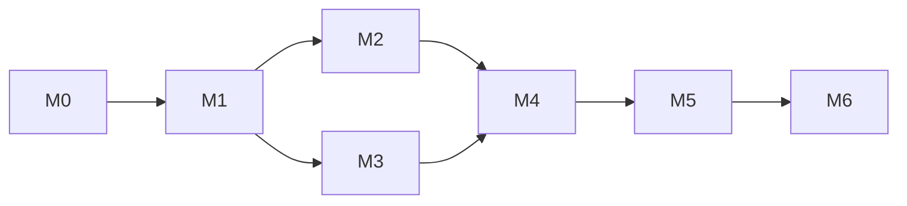

# Plan & Record 第一阶段 MVP 开发计划

> 状态：执行草案
> 编制日期：2026-07-28
> 产品基线：[product-design.zh-CN.md](./product-design.zh-CN.md)
> 适用范围：第一阶段“纯本地微信小程序闭环”

本计划只拆解实施顺序、交付物和验收门槛，不重新定义产品规则。若执行中发现会改变用户行为、数据契约或隐私边界的未决项，应先更新产品基线草案并取得确认。

## 1. 目标与完成定义

在匿名、纯本地、单设备的微信小程序中完成以下闭环：

`Wish / 备忘录 → 项目 / 任务 / OKR → 日历计划 → 计时或补录 → 候选核实 → 统计复盘 → JSON 数据管理`

MVP 完成时，用户应能在无登录、无开发者后端、无自动业务网络请求的情况下：

- 记录、暂停、恢复和结束计时，并在主动生成后得到已确认日志。
- 手工补录时间，管理分类、Wish、项目、任务、OKR 和截止日期。
- 在日、周、月、年日历查看相互独立的计划、候选和实际记录。
- 创建固定日程，并确认、修改或跳过按需投影的重复实例。
- 查看项目/分类汇总、计划与实际偏差、重叠提示和周复盘基础数据。
- 导出 JSON 全量快照；选择 JSON 文件进行增量或覆盖导入，并在预览、冲突策略和失效关联修复摘要确认后提交；清空本地资料库。
- 理解 JSON 是用户主动执行的本地迁移/恢复路径，不是云端自动备份或同步。

## 2. 范围护栏

### 2.1 第一阶段范围

| 能力域 | 最小完整交付 |
| --- | --- |
| 本地底座 | 匿名 `localProfileId`、稳定 ID、结构版本、迁移与损坏保护、默认“未分类” |
| 计时与日志 | 开始/暂停/恢复/结束/生成记录、后台与冷启动恢复、异常候选、手工补录 |
| 计划对象 | 分类、备忘录、Wish、项目、任务、OKR、截止日期、归档与放弃 |
| 日历 | 日/周/月/年视图，计划块、日志关联及计划/候选/实际统一时间轴 |
| 重复规则 | 确定性按需投影、确认、单次修改、后续修订和跳过 |
| 统计复盘 | 分类/项目汇总、计划偏差、非计划实际、候选开关、重叠提示 |
| 设置与 JSON 数据管理 | 分类管理、本地数据风险提示、JSON 全量快照导出、增量/覆盖导入预览与确认、清空数据、导出临时文件清理 |

### 2.2 明确不做

- 微信登录、云开发、自建后端、云数据库、同步、跨设备一致性和云端恢复。
- OCR / LLM、照片导入或文本 AI 导入、VIP、广告、支付、订阅消息和云端提醒。
- 团队协作、原生移动端、手表或 AI 眼镜能力。
- 后台持续运行 JavaScript 秒表，或自动把日历安排确认为真实投入。

## 3. 技术与领域约束

- 采用“页面 → 应用服务 → 领域模型 → `LocalRepository`”分层；页面不得直接读写存储。
- `CalendarEvent` 只表示计划；`TimeLog` 只表示 `candidate` 或 `confirmed`。
- 默认统计只包含 `confirmed`；日志来源在编辑或确认后保持不变。
- 所有关联使用稳定 ID；删除关联对象前保存名称或摘要快照，再清除失效引用。
- 活动项目上限只使用 `MAX_ACTIVE_PROJECTS = 5`；“放弃项目”是原子删除而非第三种状态。
- 本地写入成功后才能提示“已保存”；失败时保留用户输入，不覆盖损坏或高版本数据。
- 数据管理遵循产品基线 [5.4 节](./product-design.zh-CN.md#54-本地持久化json-导入导出与清空)：只支持本产品 JSON 全量快照；增量导入保留本机运行态，覆盖导入重建资料库并重置运行态。
- 导入在最终合并和统一冲突策略决策后修复失效关联；预览、导入提交和清空均须原子化，且导入、导出、清空共用一把页面级操作锁。
- JSON 是手动迁移/恢复路径，不构成云端自动备份或同步；CSV 不属于首版数据协议。
- 后续能力只保留禁用端口，不创建云资源、不提供可操作入口、不伪造成功；产品基线要求的待办说明除外。

## 4. 实施里程碑

以下里程碑按依赖推进。

| 里程碑 | 主要交付 | 退出条件 |
| --- | --- | --- |
| M0 工程与验收基线 | 小程序骨架、四个底部入口、分层目录、测试与模拟数据设施 | 开发者工具可编译启动；首阶段需求均映射到里程碑 |
| M1 领域与本地资料库 | 核心实体、状态规则、稳定 ID、Schema v1、`LocalRepository`、迁移和故障保护 | 领域规则与存储失败分支可脱离页面验证 |
| M2 记录闭环 | 计时状态机、持久化恢复、异常候选/草稿、手工补录、日志与分类管理 | 后台、冷启动、24 小时边界及写入失败场景通过 |
| M3 计划对象 | Wish、项目、OKR、任务、项目上限、归档恢复和放弃事务 | 状态转换、上限及历史保全符合产品基线 |
| M4 日历与重复规则 | 四种日历视图、统一时间轴、计划关联、重复规则投影与修订 | 多次查询不重复；计划、候选、实际不互相覆盖 |
| M5 统计、设置与 JSON 数据管理 | 汇总、偏差、重叠提示、周复盘、JSON 导出、增量/覆盖导入、清空和风险提示 | 统计口径由固定数据集验证；JSON 迁移/恢复闭环完整且不宣称云端备份或同步 |
| M6 发布加固 | 全链路回归、数据故障、隐私、兼容性和真机验证 | 发布门槛全部通过，产品负责人完成真机验收 |

依赖顺序：

## 5. 粗排期与资源假设

以下为规划基线，不是交付承诺；M0 完成后应按团队人数、页面设计和技术验证结果重估。

- 假设配置：2 名小程序开发，产品/设计与测试兼职参与。
- 建议周期：约 12 周；M2 与 M3 可并行，其余按依赖推进。
- 周次建议：W1 M0；W2–W3 M1；W4–W6 M2/M3；W7–W9 M4；W10 M5；W11–W12 M6。
- 测试从 M1 开始随功能同步建设，不集中留到发布前。

## 6. 验证策略

| 层级 | 重点 |
| --- | --- |
| 领域单元测试 | 状态转换、计时计算、项目放弃、重复投影、统计口径 |
| 仓储与导入集成测试 | 原子写入、迁移快照、损坏/高版本保护、JSON 校验、统一冲突策略、最终失效关联修复、陈旧预览拒绝、提交或清空失败保留旧数据、覆盖导入运行态重置、超过 5 个活动项目的导入边界、导出一致性 |
| 页面回归 | 四页签主流程、候选核实、确认框、空态和失败反馈，以及导入、导出、清空共用操作锁 |
| 模拟器与真机 | 后台/前台、杀进程冷启动、跨日期、JSON 文件导出和手动导入/清空 |
| 隐私与范围审查 | 除用户主动文件发送外无业务网络请求、无云/登录入口、日志不泄露完整业务数据 |

每个功能合并前须满足：可追溯到产品基线；正常、边界和失败分支均有验证；相关页面编译无误；未完成验证明确记录。

## 7. MVP 验收主路径

1. 首次启动创建匿名资料库和不可删除的“未分类”，全程不要求登录。
2. 创建 Wish，将其转为项目和任务，再安排为日历计划块。
3. 从计划块开始计时，经历暂停、后台和恢复后结束并生成 `confirmed` 日志。
4. 创建重复日程，验证投影、跳过、单次修改、后续修订和跨页面去重。
5. 手工补录一条 `confirmed`，再核实一条由异常恢复或重复规则产生的 `candidate`，确认两种统计口径。
6. 查看分类/项目汇总、计划偏差、非计划实际和重叠时间提示。
7. 放弃项目，确认未来对象被删除而历史事实、快照和来源被保留。
8. 在真机导出 JSON，发送给文件传输助手并从电脑微信另存后选择该 JSON；依次验证增量导入（含统一冲突策略与“修复了 N 个失效关联”摘要）、覆盖导入、清空取消与确认，以及导入或清空写入失败时旧数据仍被保留。

## 8. 发布门槛

- 第一阶段范围全部可追溯，未混入可操作的第二阶段能力或云依赖；产品基线要求的待办说明除外。
- 计时恢复、项目放弃、重复规则、统计和存储故障五类高风险测试全部通过。
- 不存在会造成数据损坏、历史事实误删、候选误计入事实或重复实例的未关闭缺陷。
- 固定并记录发布使用的基础库、开发者工具版本和真机验证范围。
- 写入失败不伪报成功；损坏或不支持版本不会被覆盖。
- 用户页的数据管理入口明确提示本地数据可能丢失；JSON 仅用于用户主动的本地迁移/恢复，不是云端自动备份或同步。

## 9. 实施前决策门禁

以下细节不在本计划中展开，但必须在对应里程碑开始前确认：

- M0：源码目录、最低基础库、测试命令和首版兼容范围。
- M1：OKR 外层结构、重复规则、优先级等尚未固化字段的 Schema；关键结果已固定为 `id`、`title`、`currentValue`，不接受 `targetValue`。
- M2：设备系统时间被修改时，现有恢复规则未覆盖的边界行为。
- M4：首版重复频率集合、日历交互与统计展示草图。
- M5：周起始日。

计划执行中产生的页面级任务、完整测试矩阵、字段定义和迁移脚本设计，在对应里程碑启动时单独补充，不纳入本 MVP 总计划。
