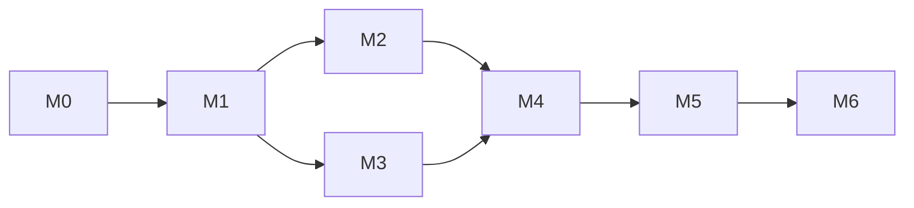

# Plan & Record 第一阶段 MVP 开发计划

> 状态：执行中。M0–M5 的主体能力已落地，但各里程碑退出条件仍须结合代码审查缺口复核；M6 发布加固、完整模拟器矩阵和真机验收尚未完成。
> 编制日期：2026-07-28
> 最近同步：2026-08-06（纳入产品基线 5.4.4 至 5.4.6 新增的结构迁移、存储容量与界面偏好要求）；2026-08-04（2.25.4 / 3.16.2 双目标模拟器验收已完成；真机与危险写路径待完成）
> 产品基线：[product-design.zh-CN.md](./product-design.zh-CN.md)
> 待复核事项：[document-review-backlog.zh-CN.md](./document-review-backlog.zh-CN.md)
> 适用范围：第一阶段“纯本地微信小程序闭环”

本计划只拆解实施顺序、交付物和验收门槛，不重新定义产品规则。若执行中发现会改变用户行为、数据契约或隐私边界的未决项，应先更新产品基线草案并取得确认。

## 1. 目标与完成定义

在匿名、纯本地、单设备的微信小程序中完成以下闭环：

`Wish / 项目 / 任务（可独立创建，也可关联项目） → 日历计划 → 计时或补录 → 候选核实 → 统计复盘 → JSON 数据管理`

MVP 完成时，用户应能在无登录、无开发者后端、无自动业务网络请求的情况下：

- 记录、暂停、恢复和结束计时，并在点击“结束计时”后得到已确认日志。
- 手工补录带可空标签的时间日志，管理 Wish、项目、任务和截止日期。
- 在日、周、月、年日历查看相互独立的计划、候选和实际记录。
- 创建固定日程，并确认、修改或跳过按需投影的重复实例。
- 查看项目/标签汇总、派生“无标签”桶、计划与实际偏差、重叠提示和周复盘基础数据。
- 导出 JSON 全量快照；选择 JSON 文件进行增量或覆盖导入，并在预览、冲突策略和失效关联修复摘要确认后提交；清空本地资料库。
- 理解 JSON 是用户主动执行的本地迁移/恢复路径，不是云端自动备份或同步。
- 随时看到本地资料库的占用与上限，在占用达到 90% 时收到导出备份提醒，并在写入因容量失败时得到可执行出口。

## 2. 范围护栏

### 2.1 第一阶段范围

| 能力域 | 最小完整交付 |
| --- | --- |
| 本地底座 | 匿名 `localProfileId`、稳定 ID、`schemaVersion = 1`、损坏与高版本保护、可逐级执行的结构迁移框架与升级前快照；已移除的旧投入维度不做兼容迁移 |
| 计时与日志 | 开始/暂停/恢复/结束并直接创建记录、秒级暂停、时间编辑、后台与冷启动恢复、计时异常和手工补录 |
| 计划对象 | Wish、项目、可独立创建且可选关联项目的任务、截止日期、归档与放弃 |
| 日历 | 日/周/月/年视图，计划块、日志关联及计划/候选/实际统一时间轴、日历逐卡重叠标记 |
| 重复规则 | `virtual plan` 的确定性按需投影、单次完整 override、JSON 稀疏 override 输入物化和跳过 |
| 统计复盘 | 标签/项目汇总、派生“无标签”桶、计划偏差、计划外、候选开关 |
| 设置与 JSON 数据管理 | 本地数据风险提示、JSON 全量快照导出、增量/覆盖导入预览与确认、清空数据、导出临时文件清理、存储用量可见与 90% 阈值预警、到量出口（导出 JSON 与只预留界面和端口的上云入口）、界面偏好纳入清空范围 |

### 2.2 明确不做

- 微信登录、云开发、自建后端、云数据库、同步、跨设备一致性和云端恢复；容量到量出口中的上云入口只预留界面与 `SyncPort` 调用，必须返回“当前版本暂不支持”，不构成可用的同步能力。
- 时间日志按时间分片存储；首版保留单键布局，分片属于第二阶段。
- OCR / LLM、照片导入或文本 AI 导入、VIP、广告、支付、订阅消息和云端提醒。
- 团队协作、原生移动端、手表或 AI 眼镜能力。
- 后台持续运行 JavaScript 秒表，或自动把日历安排确认为真实投入。

## 3. 技术与领域约束

- 采用“页面 → 应用服务 → 领域模型 → `LocalRepository`”分层；页面不得直接读写存储。
- `CalendarEvent` 只表示计划；`TimeLog` 只表示 `candidate` 或 `confirmed`。
- 关系只按产品基线 [3.1.1 节](./product-design.zh-CN.md#311-计划与实际偏差) 建立：计划块必须关联任务，项目仅由 `Task.projectId` 派生；日志只可关联一个计划块，不直接关联任务或项目。`TimeLog.tags` 是日志自身必有且可为空的值数组，不是实体关系。
- 默认统计只包含 `confirmed`；日志来源在编辑或确认后保持不变。
- 所有关联使用稳定 ID；删除关联对象前保存名称或摘要快照，再清除失效引用。
- 活动项目上限只使用 `MAX_ACTIVE_PROJECTS = 5`；“放弃项目”是原子删除而非第三种状态。
- 本地写入成功后才能提示“已保存”；失败时保留用户输入，不覆盖损坏或高版本数据。
- 数据管理遵循产品基线 [5.4 节](./product-design.zh-CN.md#54-本地持久化json-导入导出与清空)：只支持本产品 JSON 全量快照；增量导入保留本机运行态，覆盖导入重建资料库并重置运行态。
- 导入在最终合并和统一冲突策略决策后修复失效关联；预览、导入提交和清空均须原子化，且导入、导出、清空共用一把页面级操作锁。
- JSON 是手动迁移/恢复路径，不构成云端自动备份或同步；CSV 不属于首版数据协议。
- 结构迁移、存储容量与界面偏好分别遵循产品基线 [5.4.4 节](./product-design.zh-CN.md#544-结构迁移与写入原子性)、[5.4.5 节](./product-design.zh-CN.md#545-本地存储容量边界) 和 [5.4.6 节](./product-design.zh-CN.md#546-本地界面偏好)：迁移必须是逐级可执行路径并先写升级前快照；单键容量上限对用户可见、90% 预警、到量给出可执行出口；界面偏好与 `localProfile` 绑定、纳入清空范围、不进导出导入。
- 后续能力只保留禁用端口，不创建云资源、不伪造成功。除产品基线要求的待办说明，以及基线 5.4.5 规定的容量到量上云入口外，不提供可操作入口；该入口本身也必须明确返回“当前版本暂不支持”。

## 4. 实施里程碑

以下里程碑按依赖推进。

| 里程碑 | 主要交付 | 退出条件 |
| --- | --- | --- |
| M0 工程与验收基线 | 小程序骨架、四个底部入口、分层目录、测试与模拟数据设施 | 开发者工具可编译启动；首阶段需求均映射到里程碑 |
| M1 领域与本地资料库 | 核心实体、状态规则、稳定 ID、`schemaVersion = 1`、`LocalRepository`、损坏与高版本保护、结构迁移框架与升级前快照；不为已移除的旧投入维度提供兼容迁移 | 领域规则与存储失败分支可脱离页面验证；低版本快照可逐级迁移到当前版本，迁移中断或校验失败时由升级前快照还原 |
| M2 记录闭环 | 计时状态机、秒级暂停、时间编辑和计时异常处理、持久化恢复/草稿、手工补录、日志与标签输入规则 | 后台、冷启动、24 小时边界及写入失败场景通过 |
| M3 计划对象 | Wish、项目、任务、项目上限、归档恢复和放弃事务 | 状态转换、上限及历史保全符合产品基线 |
| M4 日历与重复规则 | 四种日历视图、统一时间轴、计划关联、virtual plan、单次完整 override、JSON 稀疏输入物化和日历逐卡重叠标记 | 多次查询不重复；计划、候选、实际不互相覆盖 |
| M5 统计、设置与 JSON 数据管理 | 标签/项目汇总、派生“无标签”桶、偏差、周复盘、JSON 导出、增量/覆盖导入、清空和风险提示、存储用量展示与 90% 预警、到量出口 | 统计口径由固定数据集验证；JSON 手动迁移/恢复闭环完整且不宣称云端备份或同步；容量上限在到量前即对用户可见，到量提示给出导出与预留上云两条出口，且上云入口不伪造成功 |
| M6 发布加固 | 全链路回归、数据故障、隐私、兼容性、恢复页、双基础库目标和私有配置隔离 | 按公共低版本兼容目标 `2.25.4` 与当前回归目标 `3.16.2` 验证；`3.16.2` 不是最低支持版本；产品负责人完成真机验收 |

依赖顺序：

## 5. 粗排期与资源假设

以下为规划基线，不是交付承诺；M0 完成后应按团队人数、页面设计和技术验证结果重估。

- 假设配置：2 名小程序开发，产品/设计与测试兼职参与。
- 建议周期：约 12 周；M2 与 M3 可并行，其余按依赖推进。
- 周次建议：W1 M0；W2–W3 M1；W4–W6 M2/M3；W7–W9 M4；W10 M5；W11–W12 M6。
- 测试从 M1 开始随功能同步建设，不集中留到发布前。

## 6. 验证策略

| 层级 | 重点 |
| --- | --- |
| 领域单元测试 | 状态转换、计时计算、项目放弃、重复投影、标签 NFKC/空白规范化、大小写区分、含逗号或双引号标签的文本往返、`MAX_TAGS_PER_LOG = 10`、每个标签最多 5 个汉字单位（10 个英文字母；混合时每 2 个字母折算 1 个汉字单位）、标签与项目统计口径 |
| 仓储与导入集成测试 | 原子写入、损坏/高版本保护、JSON 校验、标签规范化去空去重与首次出现顺序、标签数组顺序冲突比较、导入标签允许超限、非标签编辑保留超限标签、已移除旧字段不迁移、统一冲突策略、最终失效关联修复、陈旧预览拒绝、提交或清空失败保留旧数据、覆盖导入运行态重置、超过 5 个活动项目的导入边界、导出一致性、逐级结构迁移与升级前快照还原、容量写入失败后的数据保全；存储替身必须复现 `wx.getStorageSync` 对缺失键返回空字符串而非 `undefined` 的语义 |
| 页面回归 | 四页签主流程、候选核实、确认框、空态和失败反馈，导入、导出、清空共用操作锁，以及存储用量展示、90% 预警和到量出口 |
| 模拟器与真机 | 后台/前台、杀进程冷启动、跨日期、JSON 文件导出和手动导入/清空 |
| 隐私与范围审查 | 除用户主动文件发送外无业务网络请求、无登录入口、云相关界面仅限容量到量出口的预留上云入口且不产生网络请求、日志不泄露完整业务数据 |

每个功能合并前须满足：可追溯到产品基线；正常、边界和失败分支均有验证；相关页面编译无误；未完成验证明确记录。

## 7. MVP 验收主路径

1. 首次启动创建空匿名资料库，全程不要求登录。
2. 创建 Wish，将其转为项目和任务，再安排为日历计划块。
3. 从计划块开始计时，经历暂停、后台和恢复后点击“结束计时”并生成 `confirmed` 日志。
4. 创建重复日程，验证 `virtual plan` 投影、跳过、单次完整 override、JSON 稀疏 override 输入物化和跨页面去重。
5. 手工补录无标签、单标签和多标签 `confirmed` 日志；验证超时恢复只生成待审核草稿，并可核实保存或放弃；再核实一条持久化 `candidate` 日志，确认默认事实与包含候选两种统计口径。
6. 查看标签/项目汇总、由内部哨兵标识的派生“无标签”桶、大小写不同的标签桶、计划偏差、计划外和重叠时间提示；确认用户创建的字面标签“无标签”不会与派生桶合并。
7. 放弃项目，确认未来对象被删除而历史事实、快照和来源被保留。
8. 在真机导出 JSON，发送给文件传输助手并从电脑微信另存后选择该 JSON；依次验证标签规范化去空去重、保留首次出现顺序、允许数量或长度超限、数组顺序参与冲突比较、非标签编辑保留超限标签且实际改标签时重新执行上限，以及增量导入（含统一冲突策略与“修复了 N 个失效关联”摘要）、覆盖导入、清空取消与确认、已移除旧字段不迁移、导入或清空写入失败时旧数据仍被保留。

## 8. 发布门槛

- 第一阶段范围全部可追溯，未混入可操作的第二阶段能力或云依赖；产品基线要求的待办说明，以及基线 5.4.5 规定的容量到量上云入口除外，后者只预留界面与端口调用且必须返回“当前版本暂不支持”。
- 计时恢复、项目放弃、重复规则、统计和存储故障五类高风险测试全部通过。
- 不存在会造成数据损坏、历史事实误删、候选误计入事实或重复实例的未关闭缺陷。
- 固定并记录发布使用的基础库、开发者工具版本和真机验证范围：`2.25.4` 是公共低版本兼容目标，`3.16.2` 是当前回归目标，不是最低支持版本；`project.private.config.json` 仅保存本机私有配置，不进入版本控制或发布配置。只有在能力检测或安全降级仍无法满足要求时，才另行提出上调公共目标，不在私有配置中悄然改变团队基线。
- 2026-08-04 用户已确认把公共兼容目标调整为当前开发者工具下拉清单可选的 `2.25.4`，并把高版本回归目标调整为 `3.16.2`。同日使用微信开发者工具 `2.02.2608032` 与 `wechatide-skill 0.3.9` 完成双目标模拟器验收；基础库均由用户预先准备，本次仅只读核对工具清单和本地包，没有下载、安装、删除基础库或修改开发者工具内部清单、缓存。
  - `2.25.4`：公共配置冷开后实际 `SDKVersion` 精确为 `2.25.4`；五个页面与 `second-time-picker`、`pause-duration-input` 两个组件的 WXML / WXSS 共 `14 / 14` 项编译通过。五页均在显式刷新后重新打开，`pageStack` 精确命中目标路由，根 `.page` 与页面核心节点均为 `5 / 5` 挂载，五张默认态截图逐张确认业务内容正常；逐页完整 console 只有 `WeChatLib 2.25.4`、自动化信息和 lazy loading 信息，没有应用 error / warn。对应启动日志没有 `simulator launch failed`、`Foundation.onLoad` 或目标版本替换，且记录 `originalVersion=2.25.4, translatedVersion=2.25.4` 和本地包命中。
  - `3.16.2`：私有示例冷开后实际 `SDKVersion` 精确为 `3.16.2`，相同的 `14 / 14` 编译、五页 `pageStack`、根节点、核心节点、默认态截图和完整 console 均通过；启动日志同样没有启动失败或版本替换，并记录 `originalVersion=3.16.2, translatedVersion=3.16.2` 和本地包命中。第一次自动化采证曾在刷新后立即切页，触发开发者工具的 `appLaunch with non-empty page stack` / `routeDone with a webviewId ... is not found` 路由竞态；改为等待默认计时页核心节点就绪后再打开目标页，五页最终 console 均无 error / warn，因此只把后一次干净结果计入通过证据。
  - 当前双目标模拟器退出条件已满足；但本次没有点击会写入业务数据的操作，也未改动或清空现有模拟器资料库。计时落库、恢复故障注入、重复计划、导入 / 导出 / 覆盖 / 清空等路径仍只由 Node 自动化测试覆盖；原生展开的秒级三列选择器和真机验收仍未完成，不能由本次模拟器结果替代。
- 2026-08-04 既有验收（公共目标调整前）使用微信开发者工具 `2.02.2608032` 与 `wechatide-skill 0.3.9`。`node --test --test-isolation=none` 在沙箱外通过 `402 / 402`；当时公共 `project.config.json` 为 `2.19.4`，本机 `project.private.config.json` 以被忽略且未跟踪的方式覆盖为 `3.15.2`。
  - `3.15.2`：运行时 `SDKVersion` 确认为 `3.15.2`；五个页面与两个新增组件的 WXML / WXSS 共 `14 / 14` 项编译通过，五页页栈、默认态截图和逐页 error console 已核对，未发现应用运行时错误。模拟器还实际打开了手工补录和新建项目弹层，并完成项目选择列表滚动到底；空状态、长文本、选中 / 禁用和重叠标记仅以临时页面状态验证渲染，不等同于对应业务写入路径通过。
  - `2.19.4`（历史尝试，不再作为当前目标）：当时公共配置值已确认，但本机开发者工具可用基础库清单不含精确版本 `2.19.4`，关闭并重开项目后运行时实际回退为 `3.17.0`；因此该轮编译结果不能作为 `2.19.4` 通过证据。
  - `2.19.6`（历史尝试，不再作为当前目标）：`2.19.6` 曾下载并精确加载，但当次开发者工具 UI 出现 `simulator launch failed` 和 `Foundation.onLoad is not a function`，Page data 已初始化但关键渲染节点为 0。页面后来恢复时实际 `SDKVersion` 为 `3.17.0`，不能作为 `2.19.6` 修复证据；其后清单刷新又不再提供该版本选项，但下拉顶部仍一度显示旧配置值。现有证据不足以确定启动失败的具体成因，也不能据此断言所有开发者工具均不支持该版本。
  - 上述既有验收的证据边界：当时未改动或清空模拟器资料库；计时落库、恢复故障注入、重复计划、导入 / 导出 / 覆盖 / 清空等数据写入路径只由 Node 自动化测试覆盖，未宣称模拟器通过；原生展开的秒级三列选择器和真机验收均未验证。
- 写入失败不伪报成功；损坏或不支持版本不会被覆盖。
- 用户页的数据管理入口明确提示本地数据可能丢失；JSON 仅用于用户主动的本地迁移/恢复，不是云端自动备份或同步。

## 9. 实施前决策门禁

以下细节不在本计划中展开，但必须在对应里程碑开始前确认：

- M0：源码目录、测试命令和首版兼容范围。
- M1：重复规则、优先级等尚未固化字段的 Schema。
- M2：设备系统时间被修改时，现有恢复规则未覆盖的边界行为。
- M4：首版重复频率集合、日历交互与统计展示草图。
- M5：周起始日。

计划执行中产生的页面级任务、完整测试矩阵和字段定义，在对应里程碑启动时单独补充，不纳入本 MVP 总计划；结构迁移框架本身属于 M1 交付，某一次具体版本升级的迁移步骤在该次升级时补充；本次旧投入维度收敛为 `TimeLog.tags` 不编写兼容迁移脚本。延期项仅见 [document-review-backlog.zh-CN.md](./document-review-backlog.zh-CN.md)，不写入当前里程碑。
