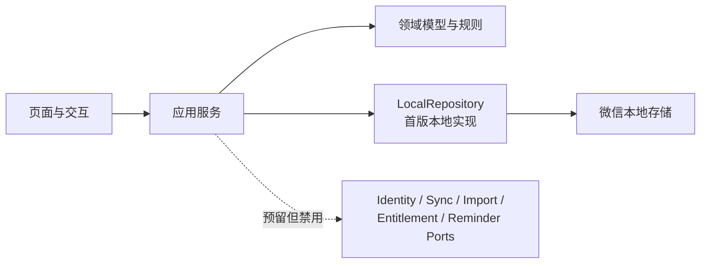

# Plan & Record 产品设计

> 状态：已确认的产品设计基线
> 日期：2026-07-30
> 适用端：首版为微信小程序；后续扩展 Android / iOS / watchOS 与特定 AI 眼镜
> 已确认延期事项仅见：[document-review-backlog.zh-CN.md](./document-review-backlog.zh-CN.md)。

## 1. 产品定位

**Plan & Record** 是一套以柳比歇夫时间统计法为事实层的个人计划系统：把尚未承诺的愿望、项目目标、待办计划、日历安排与真实时间投入放进同一条闭环，使用户以实际时间样本校正承诺和预测，而非只维护一张越来越长的待办清单。

产品不把“列出计划”误当作“已经执行”。任何数据均明确区分计划、候选与用户确认后的实际记录；统计和预测默认以实际记录为准。

### 1.1 目标用户

- 想实践柳比歇夫时间统计法，但难以持续实时记录的个人用户。
- 同时管理学习、工作和个人项目，需要了解真实可支配时间的人。
- 希望将纸质时间账本逐步数字化的人。

### 1.2 核心差异化

差异化不在于把计时器、待办、日历和项目管理并排放置，而在于以下闭环：

系统应持续回答如下问题：

1. 我是否有真实容量接下这个 Wish？
2. 这个项目按我的历史投入节奏，能否在截止日前完成？
3. 日历安排与真实时间花销的偏差在哪里，我应如何调整？

## 2. 产品原则与非目标

### 2.1 产品原则

- **用户永远拥有最终解释权。** 记录可晚、可改、可补；日历规则只产出 `virtual plan`，不能静默写成“已发生”。
- OCR 或文本 AI 解析若产生候选日志，只能产生 `TimeLog(status = "candidate")`。
- **一条事实，多种视图。** 日历、项目、待办与统计读取同一份日志和计划数据，禁止复制维护。
- **低摩擦记录，延后精化。** 开始时只需最少操作；标签、计划块关联和备注可随时补充和修改。项目归属不在日志上单独维护，而由计划块关联的任务派生。
- **来源持久化。** `TimeLog.source` 保留原始来源，候选日志被用户修改后变为 `confirmed` 状态时不得改写；JSON 全量快照导入同样不改写。用户可见的来源追溯属于已确认延期事项，见 [document-review-backlog.zh-CN.md](./document-review-backlog.zh-CN.md)。
- **隐私默认克制。** 照片不长期保存；识别前明确告知数据去向。

### 2.2 首版非目标

- 不做团队协作、成员权限、工时审批和甘特式企业项目管理。
- 不创建云开发环境、自建后端或云数据库，不做微信登录、云端同步和跨设备协同。
- 不实现 OCR / LLM 导入、VIP、广告、支付、订阅消息和云端提醒；这些能力保留为第二阶段待办。
- 不请求网络查询中国法定放假或调休安排；首版只用客户端内置表，异步查询见 [4.3.2 节假日安排的异步查询](#432-节假日安排的异步查询)。
- 不把 Apple Watch、AI 眼镜视作首版交付前提。
- 不依赖微信小程序在后台持续执行 JavaScript 秒表；未暂停的计时通过持久化时间戳恢复。
- 不自动确认用户实际做过某事。日历规则只产出 `virtual plan`；自动恢复的异常计时按 [5.3.1 超时恢复审核流程](#531-超时恢复审核流程) 只创建待审核的恢复草稿。用户主动点击“结束计时”创建记录，或手工修正恢复草稿后保存记录时，视为完成确认。
- JSON 全量快照导入只恢复快照中已有的状态，不把 `candidate` 自动转为 `confirmed`。
- OCR 或文本 AI 解析若产生候选日志，只能产生持久化的 `TimeLog(status = "candidate")`。

## 3. 统一领域模型

| 对象 | 定义 | 与其他对象的关系 |
| --- | --- | --- |
| Wish / 愿望 | 还未开始、未承诺时间的愿望或想法 | 可在评估后转为项目，也可长期留在愿望池 |
| 项目 | 有明确边界和截止日期的承诺 | 直接关联任务；计划块与日志的项目维度只通过任务派生 |
| 任务 / TODO | 可完成的单个行动项 | 可选关联一个项目；一个任务可被零到多个普通计划或重复规则引用，每个可用计划块必须关联一个任务 |
| 计时器 | 用于记录一次活动的时长并将其转换为时间日志 | 由用户启动、暂停、恢复和结束；可选关联一个计划块，但不直接选择任务或项目 |
| 日历事件 | 某时段的普通计划安排 | 必须关联一个任务；不承载重复规则，不得直接关联项目 |
| 重复规则 | 用户标记为重复执行的任务计划模板 | 每条规则只含一个必须关联任务的可投影 revision，按需投影为虚拟计划实例，不等同于实际记录 |
| 时间日志 | 一个时间区间内实际或待核实的活动 | 持有可空标签数组，可选关联一个计划块，并保留备注、来源与修订；不得直接关联任务或项目 |

### 3.1 时间日志状态与统计口径

| 状态 | 含义 | 默认计入“实际投入” |
| --- | --- | --- |
| `candidate` | 仅指持久化的 `TimeLog(status = "candidate")`，等待用户核实 | 否 |
| `confirmed` | 用户手工记录、主动点击“结束计时”创建的计时记录、手工修正恢复草稿后保存的记录，或核实候选后保留 | 是 |

注意：日历规则产出的重复实例是 `virtual plan`，不是日志状态。

### 3.1.1 计划与实际偏差

计划与实际偏差以单个计划块实例为比较单位：非重复计划块是一个 `CalendarEvent`，重复计划块是重复规则投影出的一个虚拟实例。一个计划块实例可以关联零到多条 `TimeLog`；一条 `TimeLog` 最多关联一个计划块实例，关联可空，且不能只因标签、任务或项目相同就自动建立。

- 关联非重复计划块时，日志使用 `calendarEventId`；关联重复规则投影实例时，日志使用 `originRuleId + originOccurrenceId`。两种表示互斥，都表示同一层级的“计划块关联”。
- 有效的重复计划关联必须同时具有 `originRuleId` 与 `originOccurrenceId`。重复规则被删除后，历史日志可以单独保留 `originOccurrenceId` 作为来源追溯；此时它不再构成计划块关联，不参与计划选择、关系派生或计划偏差归属。运行中的计时草稿和恢复草稿不保留这种历史例外。
- 计划块必须先关联任务；项目只由该任务的 `projectId` 派生。日志不得直接写入或编辑任务、项目关系，也不得以日志中的历史任务/项目快照参与当前关系判断。

- 默认统计只汇总关联该计划块实例的 `confirmed` 日志；用户选择“包含候选估算”时，才一并计算关联的 `candidate` 日志。
- 计划时长等于计划块实例的结束时间减开始时间；实际时长等于关联日志的时长之和；偏差等于实际时长减计划时长。实际为零表示计划尚未产生关联的实际记录，实际超出计划时显示为超时。
- 未关联计划块的日志仍计入标签汇总和总实际投入；没有标签时计入派生的“无标签”统计桶。在偏差统计中，这些日志单列为“计划外”，不归入任何计划块，也不具有可统计的任务或项目归属。
- 用户可在创建或编辑日志时关联、改关联或解除关联计划块。计时器从某个计划块启动时预填该关联；手工补录和普通计时不强制关联。

`CalendarEvent` 与 `TimeLog` 是两个实体，重复规则的虚拟实例是计划投影而不是日志。统一时间轴在界面上显示“计划 / 候选 / 实际”，分别对应日历事件或虚拟计划实例、`candidate` 日志、`confirmed` 日志。某个重复规则虚拟实例已经关联至少一条 `TimeLog` 时，日历画布只显示这些候选或实际记录，不再重复显示同一虚拟计划块；这只是视图折叠，不删除计划投影、日志关联或统计中的计划时长。

用户可在任意时间编辑、确认或作废 `TimeLog`。编辑 `candidate` 日志后，或确认一个 `virtual plan` 并创建日志后，得到 `confirmed` 日志；作废时删除候选，不得把作废记录转成事实。统计页可选“包含候选估算”，但默认事实统计只纳入 `confirmed`。

### 3.1.2 任务、计划实例与完成状态

任务的计划执行状态由 `CalendarEvent`、`RepeatRule`、重复实例、`TimeLog` 和全局计时器共同派生，不在 `Task` 上复制当前计划、今日实例、活动计时或完成记录 ID。一个任务可以同时被多个普通计划和多条重复规则引用；页面和应用服务必须按计划实例区分操作，不得只凭 `taskId` 猜测唯一计划。

- 没有关联任何普通计划或仍有效重复规则的任务是普通 TODO，用户可直接在 `todo / completed` 间切换，不产生或删除时间记录。
- 某任务只要仍有一个关联计划实例尚无 `confirmed` 日志，就不是因计划执行而完成。`candidate` 不构成完成证据；日志来源不受限制，从计时、手工补录、恢复确认或重复实例确认得到的 `confirmed` 日志均可作为对应计划实例的完成证据。
- 实体计划不因 `endedAt` 已经过期而失去执行资格；只要 `CalendarEvent` 仍存在并有效关联任务，用户就可晚于计划时间从该计划开始计时。仅当任务关联的每个 `CalendarEvent` 都至少有一条 `confirmed` 日志，且任务不再关联任何仍有效的 `RepeatRule` 时，任务才自动转为 `completed` 并写入 `completedAt`。
- “仍有效的 `RepeatRule`”指其唯一 revision 从当前时刻起仍能实际投影至少一个未跳过实例的规则。任务关联仍有效重复规则时保持 `todo`，单次虚拟计划生成日志不会完成整个任务。
- 删除、作废或改关联日志后，应用服务必须重新计算受影响任务。若某个自动完成任务不再满足上述条件，任务自动恢复为 `todo` 并清空 `completedAt`。
- 自动完成任务取消勾选时必须二次确认并删除推断出的触发记录，同时把任务恢复为 `todo`。不新增 `completionLogId`：对每个关联 `CalendarEvent` 先取其 `confirmed` 日志中 `createdAt` 最早的一条作为该计划的首次完成证据，再从这些首次证据中取 `createdAt` 最晚的一条；时间相同时按稳定日志 ID 排序。确认弹窗展示将删除记录的标题和时间。若确认前关系或记录已经变化，事务必须重新计算并拒绝删除不再匹配的目标。
- 创建、删除、改关联计划或日志，以及计时结束、恢复确认和其他能够改变完成证据的操作，都必须在同一事务中完成必要的任务状态重算，不能依赖某个页面下次刷新修复持久化状态。

### 3.2 日志字段

每条时间日志至少包含：

- `id`、`schemaVersion`
- `startedAt`、`endedAt`、`pausedDurationSeconds`、`durationMinutes`
- `calendarEventId?`、`calendarEventSummarySnapshot?`
- `originRuleId?`、`originOccurrenceId?`、`originRuleSummarySnapshot?`
- `taskNameSnapshot?`、`projectNameSnapshot?`：只用于历史展示，不构成关系
- `note?`
- `status`
- `source`：`timer`、`rule`、`ocr`、`file`、`manual`
- `tags`：持久化时必有的字符串数组，允许为空

`TimeLog.taskId?`、`TimeLog.projectId?` 只作为旧 JSON 快照的已知兼容字段保留；除原样恢复旧 JSON 快照外，新建或更新日志时必须写为 `null`，不得作为可编辑字段、有效关系或统计依据。日志可以写入由计划块取得的任务、项目名称快照，但快照只用于计划或任务删除后的历史展示。`CalendarEvent.projectId?` 以及重复规则修订上的直接项目 ID 采用相同兼容原则。

时间日志的结束时间不得早于开始时间；两者相同时不得保存。`pausedDurationSeconds` 是非负整数，缺失按 `0`。时长计算统一遵守：

- TimeLog 新增 pausedDurationSeconds：非负整数，缺失按 0。
- `intervalTotalSeconds = floor((endedAt - startedAt) / 1000)`。
- `pausedDurationSeconds = floor(累计暂停毫秒 / 1000)`。
- 必须满足 `intervalTotalSeconds > pausedDurationSeconds`。
- `durationMinutes = ceil((intervalTotalSeconds - pausedDurationSeconds) / 60)`。

计划块和重复规则仍要求结束时间晚于开始时间。

标签协议只存在于 `TimeLog.tags`，不创建独立标签实体、标签 ID 或全局标签管理数据。标签统一经过领域层的同一套规范化与校验规则，页面、应用服务和仓储不得各自实现不同版本：

- `MAX_TAGS_PER_LOG = 10` 表示用户新建日志或实际修改标签时允许保存的单条日志标签数量上限；`MAX_TAG_LENGTH = 5` 表示每个规范化标签最多可占用的汉字单位。
- 单个标签依次执行 Unicode NFKC 规范化、去除首尾空白，并把连续空白折叠为一个普通半角空格 `U+0020`。规范化后为空的标签直接移除。
- 去重以规范化后的精确字符串为准，保留第一次出现的顺序；不折叠大小写，因此 `Work` 与 `work` 是两个不同标签。持久化数组保留该顺序，数组顺序参与 JSON 内容比较。
- 长度以 `Array.from(normalizedTag)` 的 Unicode 码点计算：半角 ASCII 可打印字符（拉丁字母、数字和标点，范围 `U+0021`–`U+007E`）每个占 `0.5` 个汉字单位，其他码点（含汉字、空格、中文标点和 emoji）每个占 `1` 个汉字单位；每个标签最多 `MAX_TAG_LENGTH = 5` 个汉字单位，即最多 5 个汉字或 10 个英文字符。中英文混合时每 2 个英文字符折算 1 个汉字单位。用户实际修改标签时，在规范化、去空和去重后校验每条日志不超过 `MAX_TAGS_PER_LOG`，且每个标签不超过该长度上限。
- 页面标签文本使用中英文逗号分隔。规范化后的标签本身含逗号或双引号时，以 CSV 风格的半角双引号包裹整个标签，标签内的双引号写成两个连续双引号；领域层提供统一的可逆解析与格式化，页面不得直接用逗号拼接持久化标签。
- JSON 快照导入同样执行 NFKC、空白处理、去空和去重，但不执行上述数量与长度上限；非字符串标签仍视为字段类型错误。只编辑日志的其他字段时，必须原样保留导入规范化后得到的超限标签数组。判断标签是否实际修改时，先不限额地规范化用户提交值，再与当前持久化数组按顺序逐项比较；相同即视为未修改并保留当前值，不同才对完整的新标签数组执行数量与长度上限。

`tags` 为空数组时，统计层使用独立的内部哨兵把日志归入界面显示为“无标签”的派生桶；该桶不是持久化标签。用户可以创建字面标签“无标签”，它必须与派生桶保持不同的内部身份。

既有日志若关联了一个因任务删除而变为只读历史的计划块，编辑其他字段时保留该关联；一旦解除关联，不得重新选择该计划块。

允许时间重叠；重叠只在日历逐卡标记，不在保存时提示，也不进入统计。标签、项目、总投入、容量和预测等时长汇总均累加每条纳入统计的日志 `durationMinutes`，不按墙钟区间去重，因此汇总时长可以大于真实经过的墙钟时长。一条日志有多个标签时，其完整 `durationMinutes` 分别计入每个唯一标签桶，不在标签间均摊，因此所有标签桶合计也可以大于总实际投入。其中项目统计必须先由日志找到计划块，再由计划块的任务找到 `Task.projectId`；链路任一环缺失时不计入具体项目。

日历在当前显示范围内发现两条或以上日志存在时间交集时，仅对涉及的卡片逐一显示非阻断的“重叠时间”标记；相邻但不相交的时间区间不构成重叠。重叠不改变日志保存、状态或任何统计口径。

首版所有日期、时间和重复规则均使用运行设备的默认时区解释和展示；实体、重复规则和实例标识中都不保存或传递独立时区字段。跨设备的时区一致性不属于首版范围，留待后续同步设计。

### 3.3 其他核心对象边界

- `Project` 只保存稳定 `id`、标题、截止时间、`status`、`createdAt` 和 `updatedAt`；不包含 OKR、目标、关键结果或项目进度聚合。`Project.status` 只使用 `active / archived`；项目即使长期没有进展或暂时搁置，仍保持 `active`。归档只用于已完成项目，且是可恢复的状态转换；放弃是需要二次确认的删除操作，不增加第三种项目状态。首版活动项目上限由唯一的领域配置常量 `MAX_ACTIVE_PROJECTS = 5` 表示；新增项目和 Wish 转换都必须使用该常量校验，归档项目不计入上限。
- 所有用户可编辑标题都必须先 trim；用户可编辑标题 trim 后最多 25 个 Unicode code point。
- `Task` 至少包含稳定 `id`、标题、`status`、可选 `projectId`、`projectNameSnapshot` 和 `completedAt`。`Task.projectId?` 是任务当前项目关系的唯一权威；`Task.projectNameSnapshot?` 只用于关系失效后的历史展示，不构成关系，也不是当前项目标题的同步副本。新建任务或主动改关联到项目时写入当时的项目标题快照；用户主动取消关联时同时清空 `projectId` 和 `projectNameSnapshot`。项目被放弃或导入修复导致关系失效时，清空 `projectId` 并保留或捕获最后可知的项目标题快照。项目改名只修改 `Project.title` 和项目自身的 `updatedAt`，不得批量改写关联任务的 `projectNameSnapshot`，也不得因此推进任务的 `updatedAt`。`status` 只使用 `todo / completed`：独立 TODO 与项目子任务都直接创建为 `todo`；没有计划约束时可直接切换状态，有计划约束时遵守 [3.1.2 任务、计划实例与完成状态](#312-任务计划实例与完成状态)。当前处于早期开发，不提供旧 `inbox` 本地快照或导入文件的兼容与迁移。
- `CalendarEvent` 只表达用户单独创建的普通计划时间块，至少包含稳定 `id`、开始/结束时间、必需的 `taskId` 与 `taskNameSnapshot`；它不承载重复规则关联、`TimeLog` 的事实状态，也不直接关联项目。只有任务删除后保留的历史计划块可以没有有效 `taskId`，此时保留任务名称快照并禁止作为新日志的关联目标。计划块可选优先级为整数 `1` 到 `MAX_PLAN_PRIORITY = 3`，界面仅以由浅到深的灰蓝色表示优先级，禁止显示数值或优先级文字。
- 首版重复规则支持每日、每周（指定星期）和每月（指定日期）。创建固定日程时只持久化一条 `RepeatRule`，其中 `revisions.length === 1`；不同时创建首项 `CalendarEvent`，包含首项在内的全部实例均由唯一 revision 按需投影。界面使用非负整数“间隔数”：`0` 表示每个周期都发生，`n` 表示相邻两次发生之间空出 `n` 个周期；页面提交时将其换算为持久化的正整数步长 `RepeatRevision.interval = 间隔数 + 1`。间隔数与持久化步长都必须是 JavaScript 安全整数，且加一后的步长仍须处于安全整数范围内；输入包含符号、小数点、字母或其他非数字字符时不得删除字符后静默改写为另一个周期。revision 的 `effectiveFrom` 是首次可投影的逻辑槽位，`effectiveUntil = null` 表示未结束；“删除本次及后续”以 `occurrenceStart - 1` 设置其截止边界。产品尚未发布，首版契约从未包含固定日程种子计划块、多 revision 或 override，不提供相关旧结构识别、兼容或迁移，继续使用 `schemaVersion = 1`。
- `RepeatRevision` 的重复日期字段按频率互斥：每日规则保存 `weekdays: []`、`monthDays: []`；每周规则的 `weekdays` 必须是非空、无重复、按数字升序保存的 `0` 到 `6` 整数数组，同时保存 `monthDays: []`；每月规则的 `monthDays` 必须是非空、无重复、按数字升序保存的 `1` 到 `31` 整数数组，同时保存 `weekdays: []`。产品尚未发布，本次直接从首版契约中删除单值 `monthDay`，继续使用 `schemaVersion = 1`，不提供旧本地数据或旧 JSON 的兼容与迁移。
- 每周模式默认只选择设备当天对应的星期，星期选择按周一到周日排列；每月模式默认只选择设备当天对应的日期，日期选择按 `1` 到 `31` 排列为七列网格。日期网格的可见区域固定为两行高度，网格内部可独立纵向滚动，滚动日期时不得带动新增计划弹窗的其他表单内容。每周或每月只选择一项时，重复句式末尾显示“一次”；选择多项时显示对应的次数；取消全部选项时显示“0次”，但每周和每月规则提交时仍必须至少选择一项。
- 每月投影只在候选日期包含于 `monthDays` 时生成实例。若某月不存在所选的 `29`、`30` 或 `31` 号，则该月直接跳过对应日期，不自动挪到当月最后一天。唯一可投影 revision 必须关联任务；其虚拟实例的项目同样只由该任务的 `projectId` 派生。

## 4. 首版体验设计

### 4.1 快速计时

底部导航栏第一项（秒表图标）是计时页，用于快速记录：

- 无计时器运行时，点击主按钮直接开始记录。
- 正在计时时，主按钮变成暂停按钮；暂停后可以恢复，也可以结束计时。
- 点击“结束计时”即正式保存；该操作表示用户确认本次计时，并在同一事务中生成 `confirmed` 日志。若计时关联实体计划，还必须在该事务中重算对应任务是否满足自动完成条件。
- 所有插入计时页“最近记录”首位的 `confirmed` 日志——包括正常结束计时、手工补录，以及用户通过“待审核自动恢复记录”或“待修正恢复草稿”核实并保存的记录——都在标题右上侧显示红色 `new` 标记，并将横向最近记录自动回到第 1 页。该标记持续显示，直到又有一条更新的记录插入“最近记录”时转移至更新记录。
- 计时器只存在“准备开始 / 计时中 / 已暂停”三种状态；结束不是可停留的中间状态，也不展示“待确认”或“生成记录”操作。
- 小程序进入后台后，未暂停的计时仍按墙钟时间累计；前台恢复或冷启动时根据持久化时间戳重算，不依赖后台 JavaScript 定时器。
- 恢复时若持久化字段完整、墙钟未倒退且自开始起不超过 24 小时，则按原运行/暂停状态继续；其他情况按 [5.3.1 超时恢复审核流程](#531-超时恢复审核流程) 终止运行态并保留恢复草稿。用户手工修正或核实候选预览后保存时，视为已核实并创建 `confirmed` 日志。
- 存在恢复草稿时，不得启动新的计时，以免草稿被静默丢弃。用户必须选择“修正并确认记录”，或在明确确认后“放弃并删除记录”；后者只删除恢复草稿，不创建时间日志。
- 计时页提供“手工补录”次级入口，可填写任意过去时间区间、可空标签及可选计划块；不选计划块时记为“计划外”，用户主动保存的手工记录直接生成 `confirmed` 日志。
- 用户可随时修改当前记录的标签、可选计划块和备注；计时与补录界面不提供任务或项目选择控件。选择计划块后，任务由计划块确定，项目再由任务的 `projectId` 派生；计时中的页面表单不另设保存动作，结束计时时读取全部有效字段并保存数据，再清空表单。
- 不强制填写完整信息，而是让用户先留下可被日后修正的样本。

#### 4.1.1 照片导入

> **待办（第二阶段）**：首版不上传图片、不接入 OCR / LLM，也不展示广告入口。开发时保留 `ImportPort` 边界，不在页面或领域逻辑中直接依赖云服务。

第二阶段拟支持用户将一页或多页纸质时间账本拍照导入：

1. 在小程序中拍照或从相册选择图片。
2. 客户端经受控接口上传到私有存储。
3. 后端调用 OCR 提取原文与版面位置。
4. AI 将 OCR 结果解析为导入草稿：开始时间、结束时间、事项、可选标签、可选计划块匹配建议与备注等；不得生成标签实体或标签 ID，也不得直接生成日志的任务或项目关系。草稿确认落库前，标签必须执行 [3.2 日志字段](#32-日志字段) 的领域规范化与用户输入上限。
5. 导入页同时展示原图、OCR 原文和候选项；用户可逐条编辑、跳过或批量确认。
6. 用户确认保留后才创建日志，并保留 `source = "ocr"`。

后续还可提供可打印的纸质时间账本模板，以提高识别准确率；该模板同样不是首版范围。

#### 4.1.2 文本 AI 导入

> **待办（第二阶段）**：首版不实现文本 AI 解析。本节与首版用于迁移和恢复的 JSON 全量快照导入不是同一种能力。

第二阶段的文本 AI 导入直接把用户提交的文本解析为导入草稿，无需 OCR；草稿标签遵循 [3.2 日志字段](#32-日志字段) 的同一套领域规则，用户确认后创建的日志保留 `source = "file"`。

### 4.2 愿望/项目视图

底部导航栏第二项是愿望/项目视图，用一个 ToDoList 图标展示，页面由以下部分组成：

- TODO LIST：位于页眉之后、项目列表之前。每 3 条可见任务横向分列；禁止纵向滚动，横向滑动按整列吸附，且不显示行分隔。普通任务展示勾选框；有关联计划的任务改用颜色可区分的计时器 icon 表达执行入口。任务标题仍显示可选项目名称小字，并保留“关联项目”和“删除”图标按钮。计划执行状态统一遵守 [3.1.2 任务、计划实例与完成状态](#312-任务计划实例与完成状态)。
  - 顶部 TODO LIST 是当前可执行任务视图。没有计划约束的任务始终显示；仍有未记录实体计划的任务始终显示。只关联固定日程，或实体计划均已记录但仍关联有效固定日程的任务，只有本地今天确实投影出至少一个未跳过虚拟实例时才显示。虚拟实例以最终时间区间与本地自然日存在非零交集为“今天发生”，因此覆盖零点的实例可在相交的两天显示。页面保持前台跨过本地零点时必须自动刷新派生状态。
  - 标题右侧在排序按钮左侧提供循环筛选按钮，首次进入显示“查看全部”，连续点击依次切换为“只看计划”“不看计划”“查看全部”。“只看计划”仅保留仍关联实体计划或固定日程的任务；“不看计划”仅保留未关联任何计划的任务。筛选只改变顶部 TODO LIST 当前展示，不修改实体、关联、项目卡片或排序条件，并在当前页面会话中保持。
  - 任务关联的全部实体计划，无论 `endedAt` 是否已过，只要尚无 `confirmed` 日志，均是可启动候选。今天投影出的虚拟实例只有尚无 `confirmed` 日志时才是可启动候选。只有一个候选时点击计时器 icon 直接开始；有多个候选时先打开计划选择层，列出全部未记录实体计划和今天未记录的虚拟实例，由用户明确选择。
  - 今天所有未跳过虚拟实例都已有 `confirmed` 日志时，任务仍在当天 TODO LIST 中显示，但标题明显变淡，计时器 icon 变为静态淡色；点击只提示“今天的固定日程已记录”，不得再次启动。若同一任务今天有多个虚拟实例，必须全部已有 `confirmed` 日志才进入该状态。到下一个实际发生日自动恢复正常显示。
  - 从 TODO 开始计时与日历详情的“开始计时”使用同一计划关联和校验。全局计时器为 `running` 或 `paused` 时不得启动第二个计时：若活动计时属于其他任务或计划实例，提示“已有进行中的计时，请先结束当前计时”并拒绝；若属于当前 TODO 的某个实例，点击 icon 直接切换到计时页。当前实例运行时标题使用活动色且计时器 icon 循环播放，暂停时保留活动色、停止动画并显示清晰暂停态。
  - 任务关联的所有 `CalendarEvent` 都已有 `confirmed` 日志且不存在有效 `RepeatRule` 时，任务自动完成，左侧恢复为当前已勾选框。取消勾选执行 [3.1.2](#312-任务计划实例与完成状态) 的记录推断，先展示将删除的记录标题与时间；确认后原子删除该记录并把任务恢复为 `todo`，取消或事务失败时二者均不改变。
  - 删除普通任务仍需二次确认。删除有关联计划的任务时，确认框必须汇总所有关联实体计划和固定日程的影响，不让用户选择单条计划：确认后删除任务、所有尚未结束的关联 `CalendarEvent`、所有关联 `RepeatRule` 及其 skip；已结束实体计划和全部 `TimeLog` 保留历史快照并解除失效关系。活动计时和恢复草稿本身保留，但解除被删除的任务与计划关联。取消、校验失败或写入失败时不得部分删除。
  - TODO 的“+”入口打开新建表单，标题必填，关联活动项目可选且默认不关联；点击任务标题原地编辑。标题保存成功后不弹出提示。若该任务已关联实体计划或固定日程，须先确认「确认要修改任务标题？」后才写入；取消则不修改。未关联计划的任务直接保存。该确认同时适用于顶部 TODO LIST 与项目卡片中的标题编辑。
  - 「新建 TODO」弹窗右下提供「设定时间」：在计划页内打开与日历复用的新增计划表单；隐藏任务选择与固定日程；提交时按「新建同名任务」在同一事务内创建普通计划。从项目下新建 TODO 进入时，同名新建任务关联该活动项目；从独立 TODO 入口进入时不关联项目。`taskProjectId` 不得指向归档或不存在的项目。提交标题以计划表单当前值为准（新任务与计划同名）；取消或点遮罩返回「新建 TODO」并恢复进入「设定时间」前的任务名称。创建成功后留在计划页并刷新列表，不跳转日历、不做画布定位。日历页仍不得提供直接关联项目的控件或写入路径；计划块 `projectId` 保持为空，项目归属只由任务推导。
  - 任务的 `projectId` 能解析到现存项目时，无论任务是未完成还是已完成，项目名称小字和按项目排序都使用该 `Project.title` 的当前值，不使用 `projectNameSnapshot` 充当当前名称。项目改名后界面因此立即显示新标题，但任务持久化内容保持不变。项目已不存在而任务仍保留非空 `projectNameSnapshot` 时，小字显示“原项目：{快照名称}”，明确它只是历史信息；这类任务在按项目排序时与未关联任务同属“无当前项目”组，不把快照恢复为关系。主动取消关联后快照为空，不显示原项目文案。
- 项目视图：一个纵向列表，位于 TODO LIST 下方，展示所有项目。
  - 活动项目列表受 `MAX_ACTIVE_PROJECTS = 5` 限制；已有等于上限的活动项目时，新增和 Wish 转换都不得创建项目，并提示用户先归档、放弃或取消本次操作。
  - 列表末尾右对齐的“+”打开新建项目底部弹层；达到上限时隐藏该入口。新建项目只要求标题与截止日期。
  - 每个活动项目默认按保存顺序展示前三条未完成子任务；更多未完成项和已完成项可分别在当前项目内展开，展开状态仅保留在当前页面会话中。子任务左侧操作按其派生的任务计划状态执行普通勾选、计划计时或取消自动完成，点击标题原地编辑（已关联计划时的标题确认与顶部 TODO LIST 相同）；“+ 子任务”会预选当前项目，无未完成子任务时显示“还没有子任务”；仅在项目没有任何子任务时显示“+ 添加第一项子任务”，已有已完成子任务时显示“+ 添加子任务”。“…”收纳编辑、归档与放弃；不显示项目完成率、进度条、百分比或其他项目进度聚合。
  - 项目卡片保留该项目的完整任务清单，不应用顶部 TODO LIST 的按日隐藏；但同一任务的计时、自动完成、取消完成、淡化和删除行为必须一致。固定日程今天不发生且没有未记录实体计划时，项目卡片显示不可启动的静态日程 icon，删除入口仍可用，不能退回普通勾选以绕过计划约束。
  - 已完成的项目可归档，从列表中移除但保留数据，标记为 `archived`。
  - 不再继续的项目可放弃；放弃时按本节规则删除未来计划并保留已确认历史。
  - 历史 `confirmed` 日志只能通过独立的日志删除操作移除，不能由放弃项目级联删除。
  - 归档和放弃都必须弹出确认框；放弃确认框要明确说明删除范围与保留范围。
- 愿望视图：位于项目列表下方并默认折叠；展开后按保存顺序每 3 条横向分列展示所有未开始、未承诺时间的想法，禁止纵向滚动，横向滑动按整列吸附。每行点击标题可原地切换为自动聚焦的输入框，并在确认或失焦时保存；标题右侧使用图标提供“转为项目”和“删除”操作。删除愿望必须二次确认，且只删除目标愿望。
- 添加愿望时只需输入不超过 25 个字符的描述；添加项目时需要输入不超过 25 个字符的描述和截止日期。
- 愿望可一键转化为项目：仅在活动项目数量小于 `MAX_ACTIVE_PROJECTS` 时允许转换；描述保持不变，截止日期为当前时间后推 24 小时。
- 用户可继续编辑项目和愿望的数据。

### 4.3 日历视图

首页（小程序启动页，底部导航栏第三项）是日历视图：

- 日、周、月、年视图共用同一份日历事件与时间日志。
- 日历整体支持展示计划块、候选和实际；画布条目自身不显示状态文字，三者分别使用灰蓝实线侧边与浅色填充、灰琥珀虚线边框、深灰绿实线侧边与更深填充来区分。计划块的灰蓝色按优先级由浅到深分为三档，与实际记录的灰绿色保持可辨识的色相差异。三种显示分别来自 `CalendarEvent` 或 `virtual plan`、`candidate`、`confirmed`。同一重复规则虚拟实例已有一条或多条关联日志时，画布以关联的候选或实际记录替代该虚拟计划块，避免在相同时段重复显示计划；未关联日志的虚拟实例仍按计划块显示。
- 重复实例的详情操作固定为“开始计时、确认完成、跳过、删除本次及后续”，不提供编辑。若当前活动计时（运行中或已暂停）已关联该实例，则隐藏“确认完成”，且不得在计时结束前把该实例直接确认成记录。删除操作先显示二次确认：标题为“删除本次及后续”，内容为“将删除本次及之后的固定日程。已有时间记录会保留，但会解除计划关联。”，确认按钮为“删除”；确认成功后提示“本次及后续已删除”，关闭详情并刷新当前范围。取消、校验失败或存储写入失败时不改变页面数据。
- 日历首次进入默认展示日视图。顶部左侧显示当前浏览时间，右侧依次提供“今天、年、月、周、日”；粒度按钮等宽 `54rpx`。标题与右侧控制项按首行垂直对齐。日视图显示该日农历日期（含闰月，形如“农历七月初八”）。该日若逢传统节日或二十四节气，在农历月日后以“·”接上短名，例如“农历七月十一·处暑”“农历八月十五·中秋”；同日两者都有且名称不同时按“节日·节气”依次接上，名称相同则只显示一次。传统节日按非闰农历月日识别，含春节、元宵、端午、七夕、中秋、重阳、腊八和除夕；节气按所显示的公历自然日、以东八区日界判定。范围内有条目时，农历占用次行左侧并与颜色图例对齐；范围内无条目时，空范围提示仍占用次行左侧并与图例对齐，农历上移到范围标题正下方并以更小字号显示。周、月、年视图次行左侧仍显示空范围提示。农历日期只用于展示，由客户端按设备本地自然日换算，不写入资料库，不进入 JSON 导入导出，也不改变计划投影、筛选、统计或容量。空范围提示与颜色图例按次行垂直对齐。当前浏览范围包含设备当天时，“今天”显示 `4rpx` 描边，否则不显示描边。点击“今天”后先将锚点重置到设备当前时刻，待当前粒度画布刷新完成后，再自动把当前时间所在行滚动到可见区域：年定位当月、月定位当天日期、周定位当天、日定位当前小时前一小时以保留上下文（`00:00` 时定位首行）。年、月、周、日互相切换时保留当前锚点日期；若切换前的浏览范围包含设备当天，且新粒度范围仍包含当天，待画布刷新完成后按与点击“今天”相同的规则把当前时间线滚动到可见区域。切换前范围不含当天，或新粒度范围不再包含当天时，恢复该粒度上一次的纵向浏览位置；该粒度首次进入时停留在顶部，日视图且范围包含当前时间时可定位至当前小时。粒度切换按钮下方保留右对齐的“计划 / 记录 / 候选”颜色图例，其中“记录”对应 `confirmed` 日志，图例颜色与画布条目一致。图例右侧提供同排筛选按钮，其右边缘与首行控制项右边缘对齐；首次进入显示“查看全部”，连续点击依次切换为“只看计划”“只看记录”“查看全部”。“只看计划”仅保留普通计划和重复规则虚拟计划，“只看记录”同时保留 `confirmed` 与 `candidate` 日志；筛选只改变当前日历画布展示，不修改实体、关联、统计或当前浏览范围，并在年、月、周、日粒度切换及相邻范围翻页时保持当前筛选状态。周固定为周一至周日，跨月或跨年时标题必须保留足以消除歧义的月份和年份。
- 周、月、年视图中，某个时间格的流式内容超过折叠后仍保留的行数时，左侧时间文案成为折叠开关并显示展开状态指示；默认展开。月、年视图折叠后只保留第一行；周视图因单位格更高，折叠后仍保留前两行。再次点击恢复全部内容。折叠后可见行数不会减少的时间格不提供折叠操作，日视图保持原有分轨规则。折叠只改变当前页面会话的展示，不删除条目或修改业务数据。
- 日历画布使用固定左侧时间刻度和右侧条目区：年按 12 个月、月按当月日期并使用与周视图相同的“周一·3号”文案、周按周一至周日、日按 `00:00` 至 `23:00` 的 24 个小时行排布，不在底部重复显示 `24:00`；只有日视图按小时精确定位，其他粒度的块只显示标题。日视图的时间格线、计划块与当前时间线必须从同一画布原点按同一坐标计算，不能因逐行像素取整产生向下累计偏差；块至少完整容纳一行标题，过短时段允许扩展到 `54rpx` 的最小可读高度。同一位置发生大量重叠时，日视图最多同时绘制 `MAX_VISIBLE_LANES` 条轨道；超过上限后，最后一条可见轨道显示“+N”并聚合剩余条目，点按后列出每个被聚合条目供用户继续查看详情和操作。同一条目在一次日视图布局中只由普通块或集合块之一呈现；最后一条轨道按隐藏条目视觉区间的重叠连通关系分组，未与其他隐藏条目重叠的单项保留普通块，两项以上的连通集合使用覆盖全部成员视觉区间并集的“+N”块，且不生成“+1”或极短入口。周、月、年视图不使用轨道折叠或“+N”：每个条目在其经过的每个可见日期或月份格内生成一个分段块；年视图月份格内，同一 `RepeatRule` 的未折叠虚拟计划只保留该月按原始顺序的首个可见实例，点按进入该实例详情，不同规则、普通计划、候选和实际记录仍各自独立显示，周、月视图仍按每个实例所在日期格分段。每段高 `54rpx`，宽度随标题自然收缩且不超过屏幕宽度的 `40%`；同一格先按原始顺序处理条目，每个后续短块优先回填到最早仍有足够空间的已有行，所有已有行都放不下时才新增一行，各行内部保持原始相对顺序。行数增加时允许对应时间格同步增高。分段只复制展示，不修改原始起止时间；点按任一分段进入同一详情。当前浏览范围包含设备当前时间时，右侧条目区按当前时间在对应月份、日期或小时行中的实际比例绘制一条水平时间线；粗粒度时间线在对应动态时间格内部定位，不受前面时间格增高影响。空范围提示固定显示在左上范围标题下方。日视图有条目时该次行改为农历日期；无条目时该次行仍显示空范围提示，农历上移到标题正下方并缩小字号。周、月、年视图保持空范围提示。滚动到底后最后一个时间格必须以独立底线完整闭合，供悬浮新增按钮避让的留白不得绘制成额外时间格。点按条目先打开详情，同层提供对应操作面板。
- 周、月视图用右侧日期内容格右下角的直角小三角脚标标注休息日，不改左侧“周一·3号”文案或列宽，也不在该列旁加字。普通周六、周日使用双休日脚标色；国务院安排的法定放假日使用节假日脚标色，并优先于双休日色。普通工作日以及调休上班日不显示脚标，即使该日是周六或周日。日、年视图不显示该脚标。脚标不是计划、候选或实际记录，不进入顶部图例，不写入资料库，不进入 JSON 导入导出，也不改变重复规则投影、跳过、统计或容量。法定放假与调休上班按设备本地自然日查询客户端内置的国务院办公厅放假安排表；表未覆盖的年份不加节假日脚标，仍可按星期显示双休日脚标。脚标几何与色值见 [日历视图布局规格](./calendar-view-layout-spec-review.zh-CN.md#44-周月休息日脚标)。按年异步查询节假日安排属于后续版本，见 [4.3.2 节假日安排的异步查询](#432-节假日安排的异步查询)。
- 左右滑动画布切换相邻时间范围时，旧范围沿滑动方向退出、新范围从相反方向进入，以短促翻页过渡明确反馈范围已经变化；过渡不修改日期切换规则或数据。
- 新建计划入口为右下悬浮圆形“+”，表单使用底部弹窗。查看今天或未来日期时，日期预填当前浏览锚点；查看历史日期时，日期回填设备当天。编辑普通计划时复用同一弹窗、字段顺序和时间表单布局，预填该计划现有值，弹窗标题与确认文案切换为“编辑计划 / 保存”；不再保留独立的“编辑计划块”弹窗。编辑态不显示仅用于创建固定日程的重复设置。
- 新建成功后，普通计划以实际写入的 `CalendarEvent` 为定位目标；固定日程以创建结果中可立即投影的首项 `virtual plan` 为定位目标，若规则生效时间本身不命中所选重复日期，则仅刷新当前画布。定位目标不与当前浏览范围相交时，先把浏览锚点切换到目标开始时间所在的同粒度范围；画布刷新后，只有当目标未完整显示在当前可见区域内时，才平滑滚动到附近，已经可见时保持用户当前滚动位置。日视图中，若定位目标原本会进入重叠条目的“+N”集合块，本次定位布局必须让目标保持为独立可见块，并把与目标冲突最少的原可见轨道条目移入集合块；被移入集合的旧条目不得同时保留普通块。完整重叠时只替换最后一条原可见计划，目标跨越同轨多个不相交条目时只替换几何上必要的最少条目。周、月、年视图没有聚合块，定位到目标的第一个可见分段。该保护只作用于创建后的定位刷新，不改变持久化顺序或后续普通刷新的布局规则。
- 创建或编辑日历计划块时必须关联一个任务；日历页不得提供直接关联项目的控件或写入路径。整个资料库尚无任何任务时，新增计划弹窗不显示任务选择器，用户确认后在同一事务内静默创建一个与计划标题同名、状态为 `todo`、不关联项目的任务，再创建与之关联的普通计划或固定日程。资料库已有任务时，新增计划的任务选择层除未完成任务外还提供视觉上有区别的“新建同名任务”选项；只有用户明确选中该项时，才执行相同的原子创建与关联行为。任一步失败都不得留下孤立任务；未选择“新建同名任务”时必须明确选择现有未完成任务。编辑已有计划虽然复用新增表单，但任务选择层只提供现有任务，不提供“新建同名任务”。任务选择层只允许选项列表纵向滚动，共享弹窗头部始终固定可见。任务是否属于项目由 `Task.projectId` 决定，计划块只可把派生的项目名称作为只读上下文展示。
- 任务计划可设预估开始时间、结束时间和优先级；项目维护子任务和截止日期。
- 计时器为某个计划块生成或恢复日志后，统一时间轴显示对应的候选或实际记录。对于重复规则虚拟实例，日历画布不再重复显示同一虚拟计划块，但原计划投影、计划关联和统计口径保持不变；具体 `CalendarEvent` 仍作为独立计划实体显示。
- 记录页“最近记录”和日历时间线中的日志使用同一显示名称：`note` 去除首尾空白及不可见空白后非空时优先显示该备注；否则沿用日历回退规则，依次显示 `taskNameSnapshot` 和“时间记录”。该规则只影响界面展示，不改写日志字段或计划关联。
- 用户可在创建或编辑日志时选择一个计划块；具体 `CalendarEvent` 使用 `calendarEventId`，重复规则投影实例使用 `originRuleId + originOccurrenceId`。从计划块启动计时时预填该关联；不选时为“计划外”。日志关系控件只提供计划块，不提供任务或项目；标签是 `TimeLog` 自身的可空值字段，不属于关系控件。
- 计划块选择器必须同时包含相关的具体计划块与按记录时间范围投影的重复实例。某个计划块已经关联了日志时仍须可选，因为一个计划块允许关联多条日志；重复实例按稳定标识去重，不能按既有日志去重。
- 某个任务计划可设置为“固定习惯/循环”，例如“每天 19:30–20:30 深度工作”或“每周日 09:00–10:30 打扫卫生”。
  - 循环任务在用户查看相关日期范围时投影为 `virtual plan`，详见 [4.3.1 日历规则](#431-日历规则)。
- Wish 池不占用日历容量，只有显式转为项目后才进入计划系统。

#### 4.3.1 日历规则

采用**按需投影**：用户无需提前打开小程序；下次查看日历或统计时，客户端根据重复规则为查询范围计算 `virtual plan`。

`virtual plan` 不写入 `CalendarEvent` 或 `TimeLog`。用户确认后创建日志；用户跳过时保存该次实例的 `skip` 例外标记。所有实例使用确定性标识，避免同一规则在多次查看或未来多端同步时重复生成。

`virtual plan` 是重复规则投影出的计划块实例，不是带有 `candidate` 状态的 `TimeLog`。

日历和统计查询按实例的最终时间区间判断是否纳入：`endedAt > rangeStart && startedAt <= rangeEnd`，即与查询范围存在非零交集。跨越日、周、月或年范围起点的实例仍应被投影；单次改期以原始发生时间定位实例，再按改期后的最终区间决定移入或移出，跳过实例不纳入。纳入后的记录保留完整持续时间，不在查询边界处裁剪。

重复规则的唯一 revision 必须关联任务且不得直接关联项目。投影实例沿该 revision 取得 `taskId`，再沿 `Task.projectId` 取得项目；确认实例产生的日志保存 `originRuleId + originOccurrenceId` 作为计划块关联，并把任务、项目名称快照仅用于历史展示。

#### 4.3.2 节假日安排的异步查询

> **待办（第二阶段）**：首版不请求网络查询法定放假或调休，只用客户端内置表。

后续版本拟在进入日历或切换到尚未缓存的年份时，异步拉取国务院办公厅放假安排或等价的权威日历源，写入仅用于展示的本地缓存，再供周、月休息日脚标同步读取。按日查询契约保持 `{ kind: holiday | adjustedWorkday, name }`，不改变 [4.3 日历视图](#43-日历视图) 的脚标规则。查询失败、尚未返回或未覆盖的年份继续按首版降级：只显示双休日脚标。节假日缓存不是领域实体，不写入资料库、不进入 JSON 导入导出，也不改变重复规则投影、跳过、统计或容量。不得在画布翻页或 `buildTimeRows` 的同步路径中直接发起网络请求。实施前须确认合法请求域名、缓存失效策略和隐私说明。

### 4.4 用户视图

位于底部导航栏第四项（最右侧）。首版提供本地设置、JSON 数据管理和日志统计分析，不展示登录、VIP 或云端提醒入口。唯一与同步相关的界面是本地存储容量出口中转为云端存储的预留入口，它只预留界面与端口调用，不构成可用的同步能力。

- 用户以匿名本地资料库使用全部首版能力。
- 数据管理提供“导出 JSON”“导入 JSON”和“清空数据”。导出文件包含数据结构版本、实体 ID、关系、日志状态和来源；用户可将文件发送给文件传输助手并从电脑微信另存，也可在支持的微信环境中选择 JSON 文件进行手动迁移或恢复。
- 导入前展示模式、增量数据、冲突和失效关联修复摘要；清空或覆盖本地数据前必须二次确认。完整规则见 [5.4 本地持久化、JSON 导入导出与清空](#54-本地持久化json-导入导出与清空)。
- 数据管理区常驻展示本地资料库的当前占用与上限；占用达到阈值时主动提示导出备份，写入因容量失败时给出导出与预留上云两条出口。完整规则见 [5.4.5 本地存储容量边界](#545-本地存储容量边界)。
- 明确提示用户：小程序本地数据仍可能因清理缓存、卸载微信或更换设备而丢失；JSON 导入导出是用户主动执行的本地迁移能力，不是云端自动备份或同步。
- **待办（第二阶段）**：微信登录。
- **待办（第二阶段）**：VIP 订阅、广告门槛与支付；具体权益和价格在实施前另行确认。
- **待办（第二阶段）**：云端自动同步，以及观看广告后触发的手动同步。
- **待办（第二阶段）**：订阅消息和复盘提醒；必须在用户主动授权且平台能力允许时发送。

#### 4.4.1 日志统计分析

- 默认只统计 `confirmed`，可选择包含 `candidate` 估算。
- 首版至少提供按标签和项目汇总、按 [3.1.1 计划与实际偏差](#311-计划与实际偏差) 计算的计划与实际偏差，以及周复盘所需的基础数据。
- 标签汇总直接使用日志的 `tags`：每条日志的完整时长分别计入每个唯一标签桶，大小写不同的标签分别统计；空数组通过独立内部哨兵计入界面显示为“无标签”的派生桶，用户创建的字面标签“无标签”仍是另一个普通标签桶。项目汇总必须由日志关联的具体计划块或重复投影实例取得任务，再读取该任务当前有效的 `projectId`。无计划块、计划块缺少有效任务或任务未关联项目的日志不归入具体项目；任务/项目名称快照只用于历史展示，不参与当前项目统计。
- 具体图表样式在页面设计阶段确定，不改变上述统计口径。

## 5. 技术边界与架构

### 5.1 首版架构原则

首版采用**纯本地、匿名、单设备**架构。除用户主动导出并选择微信会话发送外，业务数据不经网络离开当前微信客户端；JSON 导入文件只在客户端本地读取和处理。首版不创建云开发环境，不调用自建或托管后端，也不实现登录、同步协议和跨设备一致性。

| 层 | 首版职责 |
| --- | --- |
| 页面与交互 | 计时显示、表单、项目和日历视图、候选核实、统计，以及 JSON 导入、导出和清空确认 |
| 应用服务 | 编排用户操作和领域规则；页面不得直接读写存储或调用未来云能力 |
| 领域模型 | 维护项目、计划、日志、计时器、重复规则及状态转换 |
| `LocalRepository` | 本地持久化、结构版本迁移、JSON 快照校验与原子导入、导出和清空 |
| 预留端口 | 首版使用匿名本地或禁用实现，只定义职责边界，不包含云配置和同步协议 |

### 5.2 核心数据边界

- `CalendarEvent` 只保存普通计划，`RepeatRule` 是固定日程唯一的持久化计划来源，且每条规则只包含一个 revision；`TimeLog` 只保存 `candidate` 或 `confirmed`。统一时间轴负责把普通计划、重复规则投影与日志组合为“计划 / 候选 / 实际”；同一重复规则虚拟实例已有关联日志时，时间轴折叠该虚拟计划块，只展示关联日志，而统计仍独立投影计划时长并汇总实际投入。
- 首版唯一有效的业务关系链是 `TimeLog → 计划块实例 → Task → Project?`：日志可不关联计划块；计划块必须关联任务；任务可不关联项目。具体计划块通过 `calendarEventId` 关联，重复投影实例通过 `originRuleId + originOccurrenceId` 关联。`TimeLog.tags` 是日志自身的值字段，不是实体关系。
- TODO 的计划执行状态是上述实体与全局计时器的派生读模型，不新增持久化的当前计划、今日实例、活动状态或完成记录 ID。派生实现必须先按任务、计划实例和日志关联建立索引，再批量计算页面任务状态，避免对每个任务反复全表扫描；任务数量或记录数量增长时，刷新开销应保持对当前快照规模的线性量级。
- `CalendarEvent.projectId`、重复规则修订的直接项目 ID，以及 `TimeLog.taskId / projectId` 是旧快照兼容字段，不属于上述关系链。除原样恢复旧 JSON 快照外，新建或更新实体时这些 ID 必须为 `null`；旧快照中的原值可以物理保留，但必须在关系校验、可选项生成、统计和后续领域写入中忽略。对应名称快照只用于历史展示，不得成为关系修复来源。
- Wish、项目、任务、日历事件、重复规则和日志从首版开始使用稳定的全局唯一 ID，禁止依赖数组下标或显示名称建立关系。
- 当前本地数据和 JSON 快照协议继续使用 `schemaVersion = 1`；每个实体至少保留 `createdAt`、`updatedAt`，需要追溯来源的实体保留不可静默改写的 `source`。固定日程只接受单 revision 与 `skip` 例外；多 revision 或 override 结构在当前 v1 中无效，不迁移、不修复。
- 首版只有本地生成的 `localProfileId`，它表示当前匿名资料库，不冒充微信账号。
- 第二阶段绑定微信账号、第四阶段跨账号迁移时，通过受控映射改变资料库归属，不重写实体 ID 和内部引用。这些能力必须由服务端鉴权、审计并再次取得用户确认，不属于首版。

### 5.3 计时器与重复规则

计时器只持久化 `idle`、`running` 或 `paused` 状态、开始时间、暂停时刻与已完成的暂停区间，以及当前填写的标签数组、可选计划块关联和备注；点击结束计时后立即重置为 `idle`，不持久化完成时间或待确认状态。为兼容旧本地快照和旧 JSON，读取时会剥离旧 `timer.endedAt` 字段；旧 `status = ended` 不得恢复为运行或暂停，而是将根计时器置为 `idle`，并安全降级为 `recoveryDraft` 供用户核实或手工修正。计时期间对页面表单的修改会同步写入当前计时草稿，因此在页面切换、进入后台或冷启动后仍可恢复；结束时由领域服务重新校验全部字段，并在同一事务中写入日志。不得持久化可编辑的任务或项目关系。计时草稿的标签也使用 [3.2 日志字段](#32-日志字段) 的领域规则。

- 前台定时器只负责刷新显示，不是计时事实来源。
- 进入后台后，只要用户没有暂停，逻辑时间继续累计；恢复前台或冷启动时按持久化时间戳重算。
- 用户主动点击“结束计时”后创建 `confirmed`。
- 恢复校验通过的条件是必需字段完整、当前墙钟不早于开始时间、暂停数据自洽，且自开始起不超过 24 小时；通过后恢复原运行/暂停状态。
- 墙钟跨度超过恢复窗口，或暂停数据不一致时终止运行态；具体处理见下节。

#### 5.3.1 超时恢复审核流程

- 当持久化计时字段和暂停区间均有效，但墙钟跨度超过恢复窗口时，终止运行态并创建 `recoveryDraft`，不得立即写入 `TimeLog`，也不得产生“最近记录”首位、`new` 标记或候选记录提示。
- `recoveryDraft` 保留原始计时草稿，并保存一份根据恢复窗口截断、扣除暂停区间后计算的 `candidatePreview`（开始、结束、时长、`source = timer`）。候选预览只用于让用户审核，**不是** `TimeLog(status = candidate)`，不参与时间线或统计；JSON 导入不恢复任何运行态草稿。
- 计时页复用恢复草稿卡片：候选预览存在时，卡片标题为“有一条待审核的自动恢复记录”，说明明确展示系统候选的时间范围与时长，并提示用户核实后确认记录。卡片提供“核实并确认记录”和“放弃并删除记录”两个操作；继续使用现有修正弹窗，并以候选预览的开始、结束以及原始计时草稿的备注、标签和计划关联作为初始值。
- 用户修改或直接接受候选预览后保存，才创建一条 `confirmed` 且 `source = timer` 的时间日志，并清除恢复草稿；用户放弃时只清除恢复草稿，不创建时间日志。恢复草稿存在期间，仍不得开始新的计时。
- 时间戳倒退、暂停区间不自洽等无法形成合法候选预览的异常，继续使用既有“待修正的恢复草稿”流程；已持久化的历史 `candidate` 日志不作迁移或改写。
- 若异常本地状态同时存在活动计时器和未处理的 `recoveryDraft`，恢复流程必须保留原恢复草稿，将冲突的活动计时器重置为 `idle` 并丢弃其数据；不得用新恢复结果或候选预览覆盖原恢复草稿。

重复规则不预先批量创建日志。每条规则只包含一个 revision，`revisions.length === 1`；该 revision 包含 `effectiveFrom` 和可空的 `effectiveUntil`。`effectiveFrom` 是规则首次可投影的逻辑槽位，`effectiveUntil = null` 表示未结束；投影仅覆盖这个有效区间，并以 `ruleId + occurrenceStart` 生成确定性的实例标识：

- 唯一 revision 必须保存有效 `taskId` 与任务名称快照，不保存有效 `projectId`；项目仅在读取时由 `Task.projectId` 派生。创建后不得修改其标题、时间、频率、间隔、重复日期、任务或优先级。
- `occurrenceStart` 是固定规则生成的逻辑发生槽位；它是跳过和删除边界的唯一依据，不因界面显示时间或计时实际开始时间改变。
- 未操作实例只存在于视图投影中，即 `virtual plan`，不是 `candidate` 日志。重复实例只提供“开始计时”“确认完成”“跳过”和“删除本次及后续”，不提供编辑。当前活动计时已关联该实例时，不得再确认完成该实例；应先结束计时。
- 确认实例时创建日志并保存来源规则与实例标识；跳过实例时保存 `OccurrenceException(kind = 'skip')`，避免下次查看时重新出现。当前 v1 不存在其他例外类型。
- “删除本次及后续”必须二次确认，并在同一个 `LocalRepository.transaction` 中原子完成。删除边界必须是当前规则可投影出的真实 `occurrenceStart`：若边界前不存在任何逻辑实例则删除整条规则；否则将唯一 revision 的 `effectiveUntil` 设为 `occurrenceStart - 1`，保留此前投影。删除范围内的 skip 例外一并清除，选中实例及未来实例不得再投影。
- 删除范围内（`originRuleId` 匹配且其 `originOccurrenceId` 所含逻辑发生时间不早于边界）的 `candidate` 与 `confirmed` 日志必须保留；若无摘要则先写入规则标题，再清空 `originRuleId`，保留 `originOccurrenceId` 作为历史来源追溯。这些日志不再构成计划关联，不再派生当前任务或项目，在偏差统计中计入“计划外”。删除边界前的日志关联保持不变。
- 删除范围内的运行中计时草稿和恢复草稿保留计时状态、时间、标签、备注及规则标题摘要，但必须同时清空 `originRuleId` 与 `originOccurrenceId`；不得结束计时或创建日志。任一步校验或写入失败时，资料库保持操作前状态，页面不得显示成功提示。

### 5.4 本地持久化、JSON 导入导出与清空

- 每次修改必须先完成本地写入，再向用户显示“已保存”；写入失败时保留表单内容。
- 多实体操作要避免半完成状态；实现时采用单快照提交或可恢复的操作标记，并为结构迁移保留升级前快照。
- 读取到不支持的数据版本或损坏数据时，启动过程必须零写入，停止覆盖原数据并显示明确的恢复说明。恢复页不提供再次校验或重试探测的控制，不支持版本时不做增量合并；用户只能通过受校验的完整快照恢复或明确清空后重建资料库。

#### 5.4.1 JSON 导出

- 每次导出以用户点击时取得的同一份应用快照生成文件；生成后发生的新写入不进入本次文件。
- JSON 全量导出包含实体 ID、关系、`schemaVersion`、日志状态、来源及每条日志必有的 `tags` 数组，不包含独立标签实体，也不导出活动计时器或恢复草稿数据。为保持当前快照结构可直接导入，导出文件固定写入空闲 `timer` 和 `recoveryDraft = null`。接收文件名为 `plan-and-record-YYYYMMDD-HHmmss.json`，使用 UTF-8 编码。
- 为读取旧快照而保留的 `CalendarEvent.projectId`、重复规则修订直接项目 ID 和 `TimeLog.taskId / projectId` 可以继续作为已知字段出现在导出协议中。新建或编辑后的实体应为 `null`；原样恢复且尚未经过领域更新的旧实体可以保留原值。无论物理值为何，它们都不表示当前有效关系；名称快照可以有值。
- JSON 不通过 `wx.openDocument` 预览。客户端确认平台支持文件发送后再生成临时文件，由用户选择微信会话发送；不支持时不生成文件，并明确提示用户升级微信。用户可发送给文件传输助手，再从电脑微信另存。
- 发送成功、取消或失败后都删除本次临时文件；进入用户页时清理由本产品旧版本明确生成的导出临时文件，但不得匹配或删除其他近似命名文件。

#### 5.4.2 JSON 导入

- 首版只支持导入本产品 JSON 全量快照协议，不支持 CSV 数据协议。用户选择文件后，客户端在本地读取、解析、校验和生成预览，确认前不得修改本地数据。
- 为兼容历史导出或同版本扩展字段，解析时只保留当前 JSON 协议已定义的字段；未知字段直接忽略，不写入本地资料库、不参与冲突比较，也不单独提示用户。已定义字段仍须完整且类型合法；`schemaVersion` 缺失或版本不受支持时拒绝整次导入。
- 本次协议调整仍使用 `schemaVersion = 1`，不为本次已移除的旧投入维度提供兼容迁移。相关旧根集合及日志字段不再是已定义字段，解析时按未知字段规则忽略，不转换为 `TimeLog.tags`。当前协议要求每条 `TimeLog` 的 `tags` 必须存在且类型为数组；缺失时拒绝整次导入。
- 每条导入的 `RepeatRule` 必须满足 `revisions.length === 1`，其唯一 revision 适用上述 `effectiveFrom` / `effectiveUntil` 规则；每条 `OccurrenceException.kind` 只能是 `skip`。多 revision、任何 override 或依赖 override 的旧结构属于当前 v1 无效数据，拒绝整次导入，不迁移、不修复，也不生成兼容摘要。
- 解析旧快照时可以读取并物理保留 `CalendarEvent.projectId`、重复规则修订直接项目 ID 和 `TimeLog.taskId / projectId`，它们作为已定义的持久化兼容字段参与内容比较。原样恢复不等于恢复有效关系：这些旧 ID 不得参与关系校验、可选项生成或统计，也不得生成新的任务/项目关系；实体下一次经领域新建或更新流程保存时，相应 ID 写为 `null`。对应名称快照可以继续保留用于历史展示。
- 解析 `TimeLog.tags` 时执行 [3.2 日志字段](#32-日志字段) 的 NFKC、首尾空白去除、连续空白折叠、去空和精确去重，并保留第一次出现的顺序；大小写不同的标签不去重。JSON 导入不执行 `MAX_TAGS_PER_LOG` 与 `MAX_TAG_LENGTH` 的业务上限，但数组元素仍必须是字符串。该规范化不是失效关联修复，不计入“修复了 N 个失效关联”。
- 导入保留实体 ID、内部关系、日志状态和原始 `source`。JSON 快照导入本身不是新的日志来源，也不会把 `candidate` 自动确认为 `confirmed`。
- 用户选择以下一种导入模式：
  - **增量导入**：保留本地数据，加入本地尚不存在的实体。同一 ID 且内容相同的实体直接跳过；同一 ID 但内容不同的实体计为数据冲突。内容比较基于解析、标签规范化后的全部持久化字段，包含 `createdAt`、`updatedAt` 等元数据；数组顺序包括 `TimeLog.tags` 的首次出现顺序，参与内容比较。比较忽略 JSON 对象属性的书写顺序，禁止直接比较原始 JSON 字符串。
  - **覆盖本地数据**：语义上先清空本地数据，再按相同的增量规则导入快照。清空、校验、修复和导入必须组成一次原子提交；任一步失败时保留导入前的完整本地数据，禁止出现已经清空但没有导入完成的状态。
- JSON 快照中的运行态不跨设备恢复：增量导入保留本机 `localProfile`、当前计时器、恢复草稿和资料库创建时间；覆盖导入创建新的 `localProfile`，把计时器重置为 `idle`、清空恢复草稿，并以导入提交时间作为新资料库的创建和更新时间。两种模式都不得导入快照中的 `timer` 或 `recoveryDraft`；导入提交成功后，根级 `updatedAt` 使用本次提交时间。
- 增量导入存在数据冲突时，预览汇总冲突数量，并要求用户对本次导入统一选择“全部保留本地”或“全部使用导入数据”；不得静默覆盖，也不对不同冲突混用策略。用户取消时整次导入不写入。
- 可修复的失效关联不视为文件损坏。引用是否失效必须以增量补充和冲突决策完成后的最终合并结果判断；只要被引用实体存在于最终结果中，就不得因它未出现在导入文件内而清空引用。导入预览必须显示“修复了 N 个失效关联”，`N` 按被清空、重映射或丢弃的失效关联逐项计数，修复规则为：
  - 任务引用的项目不存在时清空 `Task.projectId` 并保留项目名称快照。计划块或重复规则修订引用的任务不存在时清空 `taskId` 并保留任务、项目名称快照；修复前不得用于新日志关联或继续投影。已经结束的计划块只作为只读历史展示，不得通过编辑补绑任务；尚未结束的计划块可以在编辑时选择有效任务完成修复。
  - 日志引用的具体计划块不存在时清空 `calendarEventId` 并保留计划块、任务和项目名称快照；如果计划块存在但已经没有有效任务，保留已有 `calendarEventId` 仅用于历史偏差复盘，但不得把该计划块作为新选或改选目标。
  - 时间日志找不到所引用的重复规则时，清空失效的 `originRuleId` 并保留重复规则摘要快照。
  - 增量导入保留的本机计时草稿和恢复草稿也必须针对最终合并结果修复关系：具体计划块不存在或已经没有有效任务时清空 `calendarEventId`；重复实例不存在、已跳过或已经没有有效任务时同时清空 `originRuleId + originOccurrenceId`。每个被清空的计划关联计为一次修复；草稿中的旧 `taskId / projectId` 直接归一化为 `null`，不作为有效关系，也不增加修复计数。
- JSON 结构错误、必需字段或字段类型错误、`TimeLog.tags` 缺失、不是数组或含非字符串元素、导入文件内部出现重复 ID、同一日志或计时草稿同时声明具体计划块与重复计划关联、`originRuleId` 缺少配套 `originOccurrenceId`、`schemaVersion` 缺失或版本不受支持等属于不可修复的数据损坏。标签经规范化后的数量或长度超过用户输入上限不属于损坏。历史日志单独保留 `originOccurrenceId` 的情况按上文来源追溯例外处理。发现任一不可修复问题即拒绝整次导入，不生成可提交的合并结果，也不修改任何本地数据。
- 导入校验不得把 `MAX_ACTIVE_PROJECTS = 5` 当作拒绝条件。合并后可以暂时超过 5 个活动项目；之后新增项目和 Wish 转换仍执行原有上限校验，直到活动项目数量重新低于上限。
- 同一时刻只允许一个数据管理操作；从文件选择、预览、确认到原子提交结束前，不得与另一项导入、导出或清空操作交错执行。

#### 5.4.3 清空数据

- “清空数据”删除当前匿名资料库的全部用户数据、计时状态、恢复草稿、结构迁移前备份、[5.4.6 本地界面偏好](#546-本地界面偏好) 中的偏好键，以及小程序文件沙箱内由本产品明确生成且仍然存在的导出临时文件；随后重新建立一个空资料库。已由用户发送或另存到微信会话、电脑等外部位置的 JSON 文件不属于小程序本地数据，不受清空操作影响。
- 清空前必须用明确的破坏性提示二次确认；用户取消时不修改数据。清空必须先完整枚举并删除本产品拥有的导出临时文件，再原子重置资料库；目录读取、文件枚举或任一非“文件不存在”的删除失败时不得重置资料库，也不得显示成功。若临时文件已删除后资料库写入失败，仍须保留原资料库并提示失败；临时导出文件属于可重新生成的派生文件。只有文件清理和资料库重置都成功后才能清除待处理导入并提示“数据已清空”。
- 首版不保存照片等大文件。页面必须说明微信缓存、卸载或更换设备可能导致本地数据丢失。

#### 5.4.4 结构迁移与写入原子性

- 结构迁移必须是可执行路径，不是拒绝路径。读取到低于当前 `schemaVersion` 的本地资料库时，应按注册的升级步骤逐级迁移到当前版本；只有高于当前版本、缺少版本号，或迁移后仍无法通过校验的数据才进入 [5.4 本地持久化、JSON 导入导出与清空](#54-本地持久化json-导入导出与清空) 规定的零写入恢复流程。缺少可用升级步骤等同于迁移缺口，必须显式暴露，不得静默归类为“版本不受支持”而把存量用户整体推向恢复页。
- 执行结构迁移前必须把迁移前的原始值完整写入升级前快照键，迁移成功并通过校验后才允许删除。迁移中断或迁移后校验失败时，以升级前快照恢复原始数据。升级前快照与主资料库并存期间占用双份空间，必须计入 [5.4.5 本地存储容量边界](#545-本地存储容量边界) 的预算。
- 微信本地存储只提供单键写入，不提供跨键事务。因此首版“原子提交”的准确含义是：一次用户操作只产生一次主资料库写入；写入失败时尽力把主键恢复为写入前的值。恢复本身也可能失败，界面必须区分“已保留原数据”与“无法确认原数据是否完整保留”，后者引导用户立即导出核对。任何声称原子的多实体操作都不得依赖跨键写入顺序。

#### 5.4.5 本地存储容量边界

微信本地存储对单个 key 限制 1MB，对单用户单小程序的全部数据限制 10MB。首版把整个资料库序列化进一个 key，因此单 key 上限就是资料库的硬上限。

- 按当前 `TimeLog` 字段集实测，单条日志序列化后约 475 到 620 字节，约 2000 条日志即占满 1MB。目标用户每日产生 5 到 15 条记录，即每年约 1800 到 5500 条，单键布局在正常使用一年内就会到顶。
- 首版保留单键布局，不做分片，但必须补齐以下三项，使容量上限对用户始终可见、可预期、可处置：
  - **用量可见**：用户视图的数据管理区常驻展示当前资料库占用与上限。上限不得只在写入失败时以错误提示的形式暴露。
  - **阈值预警**：占用达到单 key 上限的 90% 后主动提示用户导出备份，并说明继续累积将无法保存新记录。按实测体积，剩余 10% 约合 190 条日志，即目标用户 2 到 5 周的用量，因此提示必须能在用户日常路径上被看到，不能只依赖用户主动进入数据管理区，也不得等到写入已经失败才提示。
  - **到量出口**：写入失败且原因可能是容量时，提示必须给出可执行出口，不得只提示“请重试”，因为重试同一份超限数据永远不会成功。出口有两条：一是导出 JSON 后由用户主动删除不再需要的历史记录；二是转为云端存储，首版只预留界面入口与 `SyncPort` 调用，必须明确返回“当前版本暂不支持”，不得伪造成功，也不得承诺具体上线时间，见 [5.5 后续能力预留端口](#55-后续能力预留端口)。
- 首版不采用按时间自动删除或自动归档历史日志的保留期策略。产品定位是多年时间账本，静默丢弃用户样本与 [2.1 产品原则](#21-产品原则) 的“用户永远拥有最终解释权”冲突；任何历史数据的移除都必须由用户在明确知情后主动执行。
- 容量预算必须同时计入结构迁移的升级前快照、导出临时文件和本地界面偏好，它们与主资料库共享 10MB 总量。
- 解除单键上限的手段是第二阶段的时间日志分片与云端同步：`timeLogs` 按时间分片到多个 key，主键只保留其余实体与分片清单。分片依赖可用的结构迁移框架，并须重新定义多键布局下的损坏检测与失败恢复，因此不属于首版范围，见 [7. 分期范围](#7-分期范围)。
- 无论采用何种存储布局，JSON 导出与导入协议都必须保持单个完整快照，`schemaVersion` 语义不随存储布局改变。存储分片属于实现布局，不是数据契约。

#### 5.4.6 本地界面偏好

除资料库外，客户端还持久化少量只影响界面呈现的偏好，例如 TODO 排序条件、项目折叠状态和“最近记录”的 `new` 标记位置。它们不是领域实体，不参与统计、关系判断或内容比较。

- 界面偏好不进入 JSON 导出与导入。换机或恢复后回到默认呈现是可接受结果，不计为数据丢失。
- 界面偏好必须与资料库身份绑定：`localProfile` 变化后（覆盖导入或清空重建），失配的偏好一律回退默认值，不得让上一份资料库的实体 ID 继续影响新资料库的呈现。
- [5.4.3 清空数据](#543-清空数据) 的删除范围包含界面偏好。
- 引用实体 ID 的偏好必须随实体删除同步收敛，不得只在内存中过滤而让持久化值单向增长。
- 读取偏好失败或格式不符时静默回退默认值，不打断用户；写入偏好失败不得阻断对应的业务操作。

### 5.5 后续能力预留端口

| 端口 | 首版实现 | 待办实现 |
| --- | --- | --- |
| `IdentityPort` | `AnonymousIdentity`，只返回 `localProfileId` | 第二阶段接入 CloudBase 托管微信登录 |
| `SyncPort` | 禁用；不创建 outbox，不定义同步协议。仅在 [5.4.5 本地存储容量边界](#545-本地存储容量边界) 的容量出口预留界面入口与端口调用 | 第二阶段单独设计后端持久化、冲突处理和跨设备同步，并承载时间日志分片后的容量扩展 |
| `ImportPort` | 仅指 AI 导入能力，首版禁用；本地 JSON 快照导入由微信应用服务和 `LocalRepository` 完成 | 第二阶段接入私有上传、OCR、LLM 和人工确认 |
| `EntitlementPort` | 不区分会员，不触发广告或支付 | 第二阶段接入 VIP、广告完成校验和支付权益 |
| `ReminderPort` | 禁用云端提醒 | 第二阶段在用户授权和平台能力允许时接入订阅消息 |

领域层和页面只依赖端口表达的业务能力，不依赖 `wx.cloud`、具体供应商 SDK、环境 ID 或服务地址。禁用实现必须返回明确的“当前版本暂不支持”，不能伪造成功结果。

### 5.6 第二阶段云能力边界

> **待办（第二阶段）**：本节只保留安全边界，不在首版定义具体同步协议或创建云资源。

- 登录、同步、AI 导入、权益和提醒分别设计接口，不能以一个万能云函数承载全部业务。
- 服务端从可信会话推导资源归属，不接受客户端自报用户 ID。所有读取、列表、写入、删除、导出、附件访问和异步任务查询都校验登录态与资源归属；有副作用的操作还必须校验参数和幂等键。
- OCR / LLM 只生成受限 Schema 的导入草稿，不能直接写入正式日志，也不能编造标签实体、标签 ID、项目 ID 或任务 ID；草稿确认持久化前，标签统一执行 [3.2 日志字段](#32-日志字段) 的规范化与用户输入上限。
- 原图使用私有临时对象；成功、失败、取消和孤儿上传都要有清理策略。用户明确选择保留后才能转为长期附件。
- 同步必须另行定义账号隔离、操作去重、删除墓碑、修订历史和用户可见的冲突处理；不得直接采用通用字段级最后写入优先。
- 首次微信登录合并匿名资料库时必须再次征得用户确认；切换账号后暂停并隐藏旧账号数据。

### 5.7 成本边界

首版不创建云环境，不产生产品侧云函数、数据库、存储、OCR 或模型调用成本。

> **待办（第二阶段）**：实施前按当期控制台重新核对 CloudBase 认证与套餐、数据库、函数、存储、流量、OCR、模型 Token、订阅消息和支付成本；产品设计基线不固化一次性的价格估算。

## 6. 隐私与数据安全

### 6.1 首版本地数据

- 首版业务数据默认只保存在当前设备的微信小程序本地存储中，不自动上传到开发者或第三方服务。
- 不收集 OpenID、手机号、头像或昵称，不把匿名资料库描述成微信账号。
- 导出只能由用户主动触发；导出前说明文件包含的日志、项目、备注和标签信息。用户继续选择微信会话后，导出副本会发送到该会话；这一用户主动发送行为不构成应用自动同步或云端备份。
- JSON 导入只能由用户主动选择文件触发；文件内容只在客户端本地读取和校验，不自动上传。日志、调试输出和错误提示不得包含完整导入/导出内容、密钥或不必要的个人信息。
- 用户删除日志或放弃项目时，界面必须明确说明删除范围；项目删除不得连带删除已确认日志。
- 首版提供用户主动执行的 JSON 迁移和恢复，但不承诺云端自动备份、自动同步或无人值守的换机恢复；必须在用户视图和数据管理入口明确提示本地数据丢失风险。

### 6.2 第二阶段数据处理待办

> **待办（第二阶段）**：任何云能力上线前，补齐数据处理方、用途、地域、保存期限、删除时点和失败清理策略，并完成真实生产权限验证。

- 图片上传前说明用途、接收方、保存时长和删除选项。
- 默认只长期保留结构化结果；原图、OCR 原文、模型输入输出、任务日志和备份分别定义保留期限。
- 访问控制按可信账号隔离；密钥、AppSecret、模型 Key、支付签名和长期令牌不得进入小程序代码、日志、query 或 Handoff payload。
- AI 输出、导入引用和批量写入在持久化前校验 Schema、数量、时间区间和资源归属；除 JSON 快照导入明确允许标签超出用户输入上限外，所有创建或实际修改标签的写入都由领域层执行同一套标签规则。

### 6.3 第四阶段跨账号迁移约束

- 第二阶段只允许用户确认后将匿名 `localProfileId` 一次性绑定或合并到当前首次登录的微信账号，不等同于账号间迁移。
- 跨账号迁移必须由来源账号和目标账号共同确认，保留审计记录，并提供可撤销或人工处理的失败出口。

## 7. 分期范围

### 第一阶段：纯本地微信小程序闭环

- 匿名本地资料库，不登录、不创建云环境；除用户主动文件发送导出外，不发送业务数据。
- 计时、暂停、恢复、结束、异常恢复和任意日期手工补录。
- 带可空标签的时间日志、Wish、项目、可独立创建且可选关联项目的任务、截止日期。
- 日、周、月、年日历，以及计划、候选、实际三种统一时间轴显示；周、月休息日脚标使用客户端内置放假安排表。
- 固定日程的确定性按需投影、确认、跳过和删除本次及后续。
- 基础项目和标签统计（含派生的“无标签”桶）、计划与实际偏差、周复盘。
- JSON 全量数据可通过微信文件发送导出，并支持本地校验、增量或覆盖导入；用户可二次确认后清空全部本地数据。首版不支持 CSV 数据协议。
- 本地存储用量可见、接近上限时的阈值预警，以及到达上限时的导出出口和只预留界面与端口的上云出口。

### 第二阶段：云能力、AI 导入与商业化待办

- CloudBase 托管微信登录，以及匿名资料库经确认后的账号绑定。
- 后端持久化、手动/自动同步、冲突处理、修订历史和云端恢复。
- 时间日志按时间分片存储，解除首版单键 1MB 的容量上限；分片以可用的结构迁移框架为前提。
- 纸质日志拍照导入、文本 AI 导入、OCR / LLM 草稿解析与人工确认。
- VIP、广告、支付和服务端权益校验。
- 在用户授权且平台能力允许时发送订阅消息和复盘提醒。
- 中国法定放假与调休安排改为异步查询并本地缓存，供日历周/月脚标使用；失败时降级为仅双休日标记。完整边界见 [4.3.2 节假日安排的异步查询](#432-节假日安排的异步查询)。
- 实施前完成 AppID 权限、生产鉴权、隐私、配额和计费核对。

### 第三阶段：原生高频记录入口

- 原生 Android / iOS 应用，以及独立或配套的 watchOS 应用。
- 开始、暂停、切换、完成、查看下一项和表盘快捷入口。
- 后台刷新只用于机会式同步和快照更新，不承担连续秒表或精确定时。
- 前台在线时以近实时为目标的跨设备同步，以及最终一致的离线兜底。
- 更可靠的项目完成预测与容量建议。

### 第四阶段：远期试点

- 选定一款开放协议或 SDK 的 AI 眼镜，只试点语音开始/结束计时、播报下一任务和捕捉 Wish。
- 不在验证设备 SDK、目标地区、续航、网络与隐私能力前承诺相机、手势或系统级语音控制。
- 增加经服务端鉴权、双向确认和审计的跨账号数据迁移。

## 8. 外部能力参考

- [微信小程序运行机制](https://developers.weixin.qq.com/miniprogram/dev/framework/runtime/operating-mechanism.html)
- [CloudBase：创建云开发环境](https://docs.cloudbase.net/quick-start/create-env)
- [CloudBase：微信小程序身份认证](https://docs.cloudbase.net/ai/cloudbase-ai-toolkit/prompts/auth-wechat)
- [腾讯云 OCR：通用文字识别（高精度版）](https://cloud.tencent.com/document/product/866/34937)
- [CloudBase 云函数介绍](https://docs.cloudbase.net/cloud-function/introduce)
- [微信小程序订阅消息](https://developers.weixin.qq.com/miniprogram/dev/framework/open-ability/subscribe-message.html)
- [Apple：独立 watchOS App](https://developer.apple.com/documentation/watchos-apps/creating-independent-watchos-apps/)
- [Apple：watchOS 后台任务](https://developer.apple.com/documentation/watchkit/using-background-tasks)
