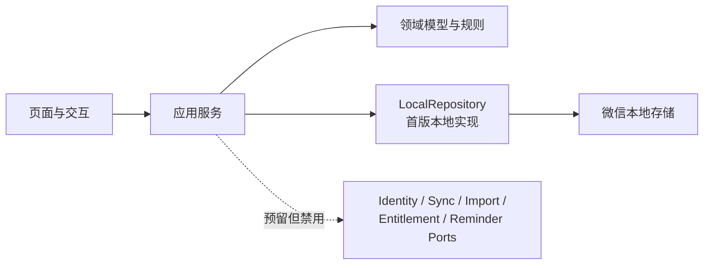

# Plan & Record 产品设计

> 状态：已确认的产品设计基线
> 日期：2026-07-27
> 适用端：首版为微信小程序；后续扩展 Android / iOS / watchOS 与特定 AI 眼镜

## 1. 产品定位

**Plan & Record** 是一套以柳比歇夫时间统计法为事实层的个人计划系统：把尚未承诺的愿望、项目目标、待办计划、日历安排与真实时间投入放进同一条闭环，使用户以实际时间样本校正承诺和预测，而非只维护一张越来越长的待办清单。

产品不把“列出计划”误当作“已经执行”。任何数据均明确区分计划、候选与用户确认后的实际记录；统计和预测默认以实际记录为准。

### 1.1 目标用户

- 想实践柳比歇夫时间统计法，但难以持续实时记录的个人用户。
- 同时管理学习、工作和个人项目，需要了解真实可支配时间的人。
- 希望将纸质时间账本逐步数字化的人。

### 1.2 核心差异化

差异化不在于把计时器、待办、日历和项目管理并排放置，而在于以下闭环：

系统应持续回答四个问题：

1. 我是否有真实容量接下这个 Wish？
2. 这个项目按我的历史投入节奏，能否在截止日前完成？
3. 我对 OKR 的实际投入是否足够？
4. 日历安排与真实时间花销的偏差在哪里，我应如何调整？

## 2. 产品原则与非目标

### 2.1 产品原则

- **用户永远拥有最终解释权。** 记录可晚、可改、可补，日历规则、OCR 和导入数据等只提出候选，不能静默写成“已发生”。
- **一条事实，多种视图。** 日历、项目、待办与统计读取同一份日志和计划数据，禁止复制维护。
- **低摩擦记录，延后精化。** 开始时只需最少操作；项目归属、备注和标签可随时补充和修改。
- **来源可见/可追溯。** 能查看一条记录来自计时器、文件导入、OCR 导入、日历规则或用户手工添加；候选记录被用户修改后变为 `confirmed` 状态，但是来源信息保持不变。
- **隐私默认克制。** 照片不长期保存；识别前明确告知数据去向。

### 2.2 首版非目标

- 不做团队协作、成员权限、工时审批和甘特式企业项目管理。
- 不创建云开发环境、自建后端或云数据库，不做微信登录、云端同步和跨设备协同。
- 不实现 OCR / LLM 导入、VIP、广告、支付、订阅消息和云端提醒；这些能力保留为第二阶段待办。
- 不把 Apple Watch、AI 眼镜视作首版交付前提。
- 不依赖微信小程序在后台持续执行 JavaScript 秒表；未暂停的计时通过持久化时间戳恢复。
- 不自动确认用户实际做过某事。日历规则、OCR 和文件导入只产出候选；用户主动结束计时并生成记录时，视为完成确认。

## 3. 统一领域模型

| 对象 | 定义 | 与其他对象的关系 |
| --- | --- | --- |
| Wish / 愿望 | 还未开始、未承诺时间的愿望或想法 | 可在评估后转为项目，也可长期留在想法池 |
| 项目 | 有结果、边界、截止日期的承诺 | 关联 OKR、任务、日历事件与日志 |
| OKR | 项目内拥有的目标与关键结果值集合 | 用于判断项目是否推进，不替代任务清单；不具有脱离项目的独立生命周期 |
| 分类 | 用户维护的时间投入分类 | 被日志引用，用于记录选择与统计汇总 |
| 任务 / 备忘录 | 同一个 `Task` 实体；备忘录是尚未整理的收集状态 | 可归入项目，也可直接排入日历或启动计时 |
| 计时器 | 用于记录一项任务的时长并将其转换为时间日志 | 由用户启动、暂停、恢复和结束；主动结束并生成记录时得到已确认日志，异常恢复时得到候选日志 |
| 日历事件 | 某时段的计划安排 | 可以关联任务或项目，可生成重复规则 |
| 重复规则 | 用户标记为重复执行的日历事件模板 | 按需投影为虚拟候选实例，不等同于实际记录 |
| 时间日志 | 一个时间区间内实际或待核实的活动 | 可关联项目、任务、分类、备注、来源与修订 |

### 3.1 时间日志状态与统计口径

| 状态 | 含义 | 默认计入“实际投入” |
| --- | --- | --- |
| `candidate` | 来自重复日程、OCR、文件导入或异常恢复计时，等待用户核实 | 否 |
| `confirmed` | 用户手工记录、主动结束并生成的计时记录，或核实候选后保留 | 是 |

### 3.1.1 计划与实际偏差

计划与实际偏差以单个 `CalendarEvent` 为比较单位。一个 `CalendarEvent` 可以关联零到多条 `TimeLog`；一条 `TimeLog` 最多关联一个 `CalendarEvent`，关联是可选的，且不能只因任务或项目相同就自动建立。

- 默认统计只汇总关联该事件的 `confirmed` 日志；用户选择“包含候选估算”时，才一并计算关联的 `candidate` 日志。
- 计划时长等于 `CalendarEvent` 的结束时间减开始时间；实际时长等于关联日志的时长之和；偏差等于实际时长减计划时长。实际为零表示计划尚未产生关联的实际记录，实际超出计划时显示为超时。
- 未关联 `CalendarEvent` 的日志仍计入分类、项目和总实际投入，在偏差统计中单列为“非计划实际”，不归入任何计划块。
- 用户可在创建或编辑日志时关联、改关联或解除关联计划块。计时器从某个计划块启动时预填该关联；手工补录和普通计时不强制关联。

`CalendarEvent` 与 `TimeLog` 是两个实体。统一时间轴在界面上显示“计划 / 候选 / 实际”，分别对应日历事件、`candidate` 日志或虚拟候选实例、`confirmed` 日志。

用户可在任意时间编辑、确认或作废 `TimeLog`。编辑 `candidate` 日志或确认保留虚拟候选实例后，转为 `confirmed` 日志；作废时删除候选，不得把作废记录转成事实。统计页可选“包含候选估算”，但默认事实统计只纳入 `confirmed`。

### 3.2 日志字段

每条时间日志至少包含：

- `id`、`schemaVersion`
- `startedAt`、`endedAt`、`durationMinutes`
- `categoryId`、`categoryNameSnapshot`、`projectId?`、`projectNameSnapshot?`、`taskId?`、`taskNameSnapshot?`
- `calendarEventId?`、`calendarEventSummarySnapshot?`
- `note?`
- `status`
- `source`：`timer`、`rule`、`ocr`、`file`、`manual`
- `originRuleId?`、`originOccurrenceId?`、`originRuleSummarySnapshot?`
- `tags[]?`

允许时间重叠，但在保存时给出提醒；例如用户可能希望保留“通勤时听课程”这种双重归类。分类、项目、总投入、容量和预测统计均直接累加每条纳入统计的日志 `durationMinutes`，不按墙钟区间去重，因此汇总时长可以大于真实经过的墙钟时长。

用户视图中的统计页，在当前显示时间范围内发现两条或以上纳入当前统计口径的日志存在时间交集时，必须显示非阻断的“重叠时间”提示。提示列出每组重叠的两个任务及重叠分钟数。同一对日志在同一显示范围内只提示一次；相邻但不相交的时间区间不构成重叠。默认只检测 `confirmed` 日志，用户选择“包含候选估算”时一并检测 `candidate` 日志。

首版所有日期、时间和重复规则均使用运行设备的默认时区解释和展示；实体、重复规则和实例标识中都不保存或传递独立时区字段。跨设备的时区一致性不属于首版范围，留待后续同步设计。

### 3.3 其他核心对象边界

- `Category` 至少包含稳定 `id`、名称和 `active / archived` 状态。每个本地资料库都有不可删除的“未分类”；用户没有选择分类时使用它。已被日志引用的其他分类只能归档，归档后不再用于新记录；日志保留 `categoryNameSnapshot`。
- `Project.status` 只使用 `active / archived`；项目即使长期没有进展或暂时搁置，仍保持 `active`。归档只用于已完成项目，且是可恢复的状态转换；放弃是需要二次确认的删除操作，不增加第三种项目状态。首版活动项目上限由唯一的领域配置常量 `MAX_ACTIVE_PROJECTS = 5` 表示；新增项目和 Wish 转换都必须使用该常量校验，归档项目不计入上限。
- OKR 作为 `Project` 聚合内的值集合随项目保存和删除，不单独成为可脱离项目存在的顶层实体。
- `Task` 至少包含稳定 `id`、不超过 25 个字符的标题、`status`、可选 `projectId`、`projectNameSnapshot` 和 `completedAt`。`status` 只使用 `inbox / todo / completed`：新备忘录为 `inbox`，整理后转为 `todo`，完成后转为 `completed`；完成任务可重新打开为 `todo`。
- `OKR` 的关键结果只包含标题、当前值与目标值；当前值和目标值均为 `[0, 100]` 范围内的整数，界面以百分号展示。关键结果不保存单位字段。
- `CalendarEvent` 只表达计划时间块，至少包含稳定 `id`、开始/结束时间、可选任务/项目关联及其名称快照，以及可选重复规则关联和 `repeatRuleSummarySnapshot?`；它不承载 `TimeLog` 的事实状态。计划块可选优先级为整数 `1` 到 `MAX_PLAN_PRIORITY = 3`，界面仅以由浅到深的绿色表示优先级，禁止显示数值或优先级文字。`TimeLog` 可以通过 `calendarEventId` 关联计划块，用于计算计划与实际偏差。
- 首版重复规则支持每日、每周（指定星期）和每月（按日期），均可设置正整数间隔值。

## 4. 首版体验设计

### 4.1 快速计时

首页（底部导航栏第一项，用一个秒表图标展示）就是计时功能：

- 无计时器运行时，点击主按钮直接开始记录。
- 正在计时时，主按钮变成暂停按钮；暂停后可以恢复，也可以结束计时。
- 结束后必须点击“生成记录”才正式保存；该操作表示用户确认本次计时，生成 `confirmed` 日志。
- 小程序进入后台后，未暂停的计时仍按墙钟时间累计；前台恢复或冷启动时根据持久化时间戳重算，不依赖后台 JavaScript 定时器。
- 恢复时若持久化字段完整、墙钟未倒退且自开始起不超过 24 小时，则按原运行/暂停状态继续；超过 24 小时或暂停区间不一致时终止运行态，并以可恢复时间生成 `candidate`。若连合法时间区间都无法还原，只保留恢复草稿，用户修正后才能创建候选日志。
- 首页提供“手工补录”次级入口，可填写任意过去时间区间、分类及可选项目/任务；用户主动保存的手工记录直接生成 `confirmed` 日志。
- 用户可随时修改当前记录的分类、项目归属、任务名称、标签和备注；生成记录后保存数据并清空表单。
- 不强制填写完整信息，而是让用户先留下可被日后修正的样本。

#### 4.1.1 照片导入

> **待办（第二阶段）**：首版不上传图片、不接入 OCR / LLM，也不展示广告入口。开发时保留 `ImportPort` 边界，不在页面或领域逻辑中直接依赖云服务。

第二阶段拟支持用户将一页或多页纸质时间账本拍照导入：

1. 在小程序中拍照或从相册选择图片。
2. 客户端经受控接口上传到私有存储。
3. 后端调用 OCR 提取原文与版面位置。
4. AI 将 OCR 结果解析为导入草稿：开始时间、结束时间、事项、分类、项目与备注等。
5. 导入页同时展示原图、OCR 原文和候选项；用户可逐条编辑、跳过或批量确认。
6. 用户确认保留后才创建日志，并保留 `source = "ocr"`。

后续还可提供可打印的纸质时间账本模板，以提高识别准确率；该模板同样不是首版范围。

#### 4.1.2 文件导入

> **待办（第二阶段）**：首版不实现文件 AI 解析。

第二阶段的文件导入直接把用户提交的文本解析为导入草稿，无需 OCR；用户确认后创建的日志保留 `source = "file"`。

### 4.2 愿望/项目视图

底部导航栏第二项是愿望/项目视图，用一个 ToDoList 图标展示，页面由以下部分组成：

- 项目视图：一个纵向列表，占据屏幕顶部，展示所有项目（有 OKR 和截止日期的复杂任务）。
  - 活动项目列表受 `MAX_ACTIVE_PROJECTS = 5` 限制；已有等于上限的活动项目时，新增和 Wish 转换都不得创建项目，并提示用户先归档、放弃或取消本次操作。
  - 已完成的项目可归档，从列表中移除但保留数据，标记为 `archived`。
  - 不再继续的项目可放弃：删除项目、OKR、未完成任务、尚未结束的日历事件、这些事件的重复规则/修订/跳过标记，以及关联的 `candidate` 日志。已结束的历史日历事件、已完成任务和 `confirmed` 日志作为复盘历史保留，并按 [5.2 核心数据边界](#52-核心数据边界) 清空所有失效的项目、任务和重复规则引用。
  - 历史 `confirmed` 日志只能通过独立的日志删除操作移除，不能由放弃项目级联删除。
  - 归档和放弃都必须弹出确认框；放弃确认框要明确说明删除范围与保留范围。
  - 可点击查看项目关联的子任务列表，列表以弹层展示，分为已完成和未完成两个页签；首版只展示任务名称。
- 愿望视图：一个纵向列表，位于项目列表下方，展示所有未开始、未承诺时间的想法。
- 页面提供任务/备忘录收集入口：只填标题时创建 `inbox`，整理后可转为 `todo` 并选择项目，也可将任务标记为 `completed` 或重新打开。
- 添加愿望时只需输入不超过 25 个字符的描述；添加项目时需要输入不超过 25 个字符的描述、OKR 和截止日期。
- 愿望可一键转化为项目：仅在活动项目数量小于 `MAX_ACTIVE_PROJECTS` 时允许转换；描述保持不变，OKR 为空且用户可随时补充，截止日期为当前时间后推 24 小时。
- 用户可继续编辑项目和愿望的数据。

### 4.3 日历视图

底部导航栏第三项是日历视图：

- 日、周、月、年视图共用同一份日历事件与时间日志。
- 日历同时展示计划块、候选和实际，并用文字状态、边框和颜色区分；三种显示分别来自 `CalendarEvent`、虚拟候选或 `candidate`、`confirmed`。
- 点击计划块或日志可进入统一详情：计划块可编辑计划；`candidate` 可编辑、确认或作废；`confirmed` 可编辑或经二次确认后删除。任何编辑都保留原始 `source`，项目放弃不能代替日志删除。
- 日历计划块可关联任务（任务计划）；任务计划可再关联项目（项目计划）。
- 任务计划可设预估开始时间、结束时间、优先级和所属项目；项目自身维护 OKR、子任务和截止日期，日历事件只保存关联。
- 计时器为某个任务生成或恢复日志后，统一时间轴显示对应的候选或实际记录，但不覆盖原计划实体。
- 用户可在创建或编辑日志时选择一个计划块建立 `calendarEventId` 关联；从计划块启动计时时预填该关联。该关联只用于计划与实际偏差统计，不改变计划实体本身。
- 某个任务计划可设置为“固定习惯/循环”，例如“每天 19:30–20:30 深度工作”或“每周日 09:00–10:30 打扫卫生”。
  - 循环任务在用户查看相关日期范围时投影为虚拟候选，详见 [4.3.1 日历规则](#431-日历规则)。
- Wish 池不占用日历容量，只有显式转为项目后才进入计划系统。

#### 4.3.1 日历规则

采用**按需投影**：用户无需提前打开小程序；下次查看日历或统计时，客户端根据重复规则为查询范围计算虚拟候选实例。

虚拟候选不立即写入 `TimeLog`。用户确认或编辑后创建日志；用户跳过时保存该次实例的例外标记。所有实例使用确定性标识，避免同一规则在多次查看或未来多端同步时重复生成。

### 4.4 用户视图

位于底部导航栏第四项（最右侧）。首版提供本地设置、数据导出和日志统计分析，不展示登录、VIP、同步或云端提醒入口。

- 用户以匿名本地资料库使用全部首版能力。
- 本地设置包含分类管理：可创建、重命名和归档分类；归档不改写历史日志中的分类名称快照。
- 支持 JSON 全量导出和 CSV 日志导出；导出内容包含数据结构版本、日志状态和来源。首版不支持把 JSON 直接导入或恢复，不能把导出描述成已经可恢复的备份。
- 明确提示用户：小程序本地数据可能因清理缓存、卸载微信或更换设备而丢失，首版不提供云端恢复。
- **待办（第二阶段）**：微信登录。
- **待办（第二阶段）**：VIP 订阅、广告门槛与支付；具体权益和价格在实施前另行确认。
- **待办（第二阶段）**：云端自动同步，以及观看广告后触发的手动同步。
- **待办（第二阶段）**：订阅消息和复盘提醒；必须在用户主动授权且平台能力允许时发送。

#### 4.4.1 日志统计分析

- 默认只统计 `confirmed`，可选择包含 `candidate` 估算。
- 首版至少提供按分类和项目汇总、按 [3.1.1 计划与实际偏差](#311-计划与实际偏差) 计算的计划与实际偏差，以及周复盘所需的基础数据。
- 具体图表样式在页面设计阶段确定，不改变上述统计口径。

## 5. 技术边界与架构

### 5.1 首版架构原则

首版采用**纯本地、匿名、单设备**架构。除用户主动导出外，业务数据不经网络离开当前微信客户端；不创建云开发环境，不调用自建或托管后端，也不实现登录、同步协议和跨设备一致性。

| 层 | 首版职责 |
| --- | --- |
| 页面与交互 | 计时显示、表单、项目和日历视图、候选核实、统计与导出 |
| 应用服务 | 编排用户操作和领域规则；页面不得直接读写存储或调用未来云能力 |
| 领域模型 | 维护项目、计划、日志、计时器、重复规则及状态转换 |
| `LocalRepository` | 本地持久化、结构版本迁移、读取恢复和导出 |
| 预留端口 | 首版使用匿名本地或禁用实现，只定义职责边界，不包含云配置和同步协议 |

### 5.2 核心数据边界

- `CalendarEvent` 保存计划；`TimeLog` 只保存 `candidate` 或 `confirmed`。统一时间轴负责把两类实体投影为“计划 / 候选 / 实际”。
- Wish、项目、分类、任务、日历事件、重复规则和日志从首版开始使用稳定的全局唯一 ID，禁止依赖数组下标或显示名称建立关系。
- 每份本地数据包含 `schemaVersion`；每个实体至少保留 `createdAt`、`updatedAt`，需要追溯来源的实体保留不可静默改写的 `source`。
- 首版只有本地生成的 `localProfileId`，它表示当前匿名资料库，不冒充微信账号。
- 放弃项目作为一个原子本地操作：以确认删除的时刻为界，删除项目、OKR、未完成任务、尚未结束的日历事件、这些事件的重复规则及修订、虚拟实例、跳过标记和关联的 `candidate` 日志。
- 已完成任务及 `confirmed` 日志保留为历史。已完成任务保存项目名称快照并清空 `projectId`；日志保存项目名称快照并清空 `projectId`，若关联任务也被删除，再保存任务名称快照并清空 `taskId`。
- 结束时间不晚于删除时刻的历史 `CalendarEvent` 为计划偏差复盘继续保留；它保存项目、任务和重复规则摘要快照，并清空已失效的 `projectId`、`taskId` 和 `repeatRuleId`。删除重复规则后，保留的历史事件不得再通过该 ID 查询或投影规则实例。
- 来自被删除重复规则的 `confirmed` 日志继续保留 `source = "rule"` 和 `originOccurrenceId`，保存 `originRuleSummarySnapshot` 后清空 `originRuleId`；删除规则后不得再投影新实例。
- 第二阶段绑定微信账号、第四阶段跨账号迁移时，通过受控映射改变资料库归属，不重写实体 ID 和内部引用。这些能力必须由服务端鉴权、审计并再次取得用户确认，不属于首版。

### 5.3 计时器与重复规则

运行中的计时器至少持久化开始时间、当前状态、暂停区间或累计暂停时长，以及当前填写的业务字段。

- 前台定时器只负责刷新显示，不是计时事实来源。
- 进入后台后，只要用户没有暂停，逻辑时间继续累计；恢复前台或冷启动时按持久化时间戳重算。
- 用户主动结束并点击“生成记录”后创建 `confirmed`。
- 恢复校验通过的条件是必需字段完整、当前墙钟不早于开始时间、暂停数据自洽，且自开始起不超过 24 小时；通过后恢复原运行/暂停状态。
- 墙钟跨度超过 24 小时或暂停数据不一致时终止运行态，以仍可还原的合法区间创建 `candidate`；无法还原合法区间时只保留恢复草稿，禁止写入无效日志。

重复规则不预先批量创建日志。每个规则修订包含 `effectiveFrom` 和可选 `effectiveUntil`；查询范围只使用覆盖该时间段的修订，并以 `ruleId + ruleRevision + occurrenceStart` 生成确定性的实例标识：

- 未操作实例只存在于视图投影中。
- 确认或编辑实例时创建日志，并保存来源规则与实例标识。
- 跳过实例时保存例外标记，避免下次查看时重新出现。
- 只编辑一次实例时创建该次 override，不修改规则；编辑“此项及后续”时创建从所选实例起生效的新修订，并结束旧修订的生效区间。
- 已确认、已编辑或已跳过的实例不因规则修改而重写；投影新修订前，以 `ruleId + occurrenceStart` 检查跨修订 override/跳过标记，避免同一次实例重新出现。

### 5.4 本地持久化与导出

- 每次修改必须先完成本地写入，再向用户显示“已保存”；写入失败时保留表单内容并提供重试或导出入口。
- 多实体操作要避免半完成状态；实现时采用单快照提交或可恢复的操作标记，并为结构迁移保留升级前快照。
- 读取到不支持的数据版本或损坏数据时停止覆盖原数据，显示明确的恢复说明。
- JSON 全量导出包含实体 ID、关系、`schemaVersion`、日志状态与来源；CSV 用于日志和统计分析。首版没有 JSON 导入/恢复流程，两者都不构成云端或换机恢复承诺。
- 首版不保存照片等大文件。页面必须说明微信缓存、卸载或更换设备可能导致本地数据丢失。

### 5.5 后续能力预留端口

| 端口 | 首版实现 | 待办实现 |
| --- | --- | --- |
| `IdentityPort` | `AnonymousIdentity`，只返回 `localProfileId` | 第二阶段接入 CloudBase 托管微信登录 |
| `SyncPort` | 禁用；不创建 outbox，不定义同步协议 | 第二阶段单独设计后端持久化、冲突处理和跨设备同步 |
| `ImportPort` | 禁用；页面显示待办说明 | 第二阶段接入私有上传、OCR、LLM 和人工确认 |
| `EntitlementPort` | 不区分会员，不触发广告或支付 | 第二阶段接入 VIP、广告完成校验和支付权益 |
| `ReminderPort` | 禁用云端提醒 | 第二阶段在用户授权和平台能力允许时接入订阅消息 |

领域层和页面只依赖端口表达的业务能力，不依赖 `wx.cloud`、具体供应商 SDK、环境 ID 或服务地址。禁用实现必须返回明确的“当前版本暂不支持”，不能伪造成功结果。

### 5.6 第二阶段云能力边界

> **待办（第二阶段）**：本节只保留安全边界，不在首版定义具体同步协议或创建云资源。

- 登录、同步、导入、权益和提醒分别设计接口，不能以一个万能云函数承载全部业务。
- 服务端从可信会话推导资源归属，不接受客户端自报用户 ID。所有读取、列表、写入、删除、导出、附件访问和异步任务查询都校验登录态与资源归属；有副作用的操作还必须校验参数和幂等键。
- OCR / LLM 只生成受限 Schema 的导入草稿，不能直接写入正式日志，也不能编造项目或任务 ID。
- 原图使用私有临时对象；成功、失败、取消和孤儿上传都要有清理策略。用户明确选择保留后才能转为长期附件。
- 同步必须另行定义账号隔离、操作去重、删除墓碑、修订历史和用户可见的冲突处理；不得直接采用通用字段级最后写入优先。
- 首次微信登录合并匿名资料库时必须再次征得用户确认；切换账号后暂停并隐藏旧账号数据。

### 5.7 成本边界

首版不创建云环境，不产生产品侧云函数、数据库、存储、OCR 或模型调用成本。

> **待办（第二阶段）**：实施前按当期控制台重新核对 CloudBase 认证与套餐、数据库、函数、存储、流量、OCR、模型 Token、订阅消息和支付成本；产品设计基线不固化一次性的价格估算。

## 6. 隐私与数据安全

### 6.1 首版本地数据

- 首版业务数据只保存在当前设备的微信小程序本地存储中，不上传到开发者或第三方服务。
- 不收集 OpenID、手机号、头像或昵称，不把匿名资料库描述成微信账号。
- 导出只能由用户主动触发；导出前说明文件包含的日志、项目、备注和标签信息。
- 日志、调试输出和错误提示不得包含完整导出内容、密钥或不必要的个人信息。
- 用户删除日志或放弃项目时，界面必须明确说明删除范围；项目删除不得连带删除已确认日志。
- 首版不承诺云端备份或换机恢复，必须在用户视图和导出入口明确提示本地数据丢失风险。

### 6.2 第二阶段数据处理待办

> **待办（第二阶段）**：任何云能力上线前，补齐数据处理方、用途、地域、保存期限、删除时点和失败清理策略，并完成真实生产权限验证。

- 图片上传前说明用途、接收方、保存时长和删除选项。
- 默认只长期保留结构化结果；原图、OCR 原文、模型输入输出、任务日志和备份分别定义保留期限。
- 访问控制按可信账号隔离；密钥、AppSecret、模型 Key、支付签名和长期令牌不得进入小程序代码、日志、query 或 Handoff payload。
- AI 输出、导入引用和批量写入在持久化前校验 Schema、数量、时间区间和资源归属。

### 6.3 第四阶段跨账号迁移约束

- 第二阶段只允许用户确认后将匿名 `localProfileId` 一次性绑定或合并到当前首次登录的微信账号，不等同于账号间迁移。
- 跨账号迁移必须由来源账号和目标账号共同确认，保留审计记录，并提供可撤销或人工处理的失败出口。

## 7. 分期范围

### 第一阶段：纯本地微信小程序闭环

- 匿名本地资料库，不登录、不创建云环境、不发送业务数据。
- 计时、暂停、恢复、结束、异常恢复和任意日期手工补录。
- 分类、备忘录、Wish、项目、任务、OKR、截止日期。
- 日、周、月、年日历，以及计划、候选、实际三种统一时间轴显示。
- 固定日程的确定性按需投影、确认、修改和跳过。
- 基础项目和分类统计、计划与实际偏差、周复盘。
- JSON 全量数据导出和 CSV 日志导出；首版不提供 JSON 导入恢复。

### 第二阶段：云能力、AI 导入与商业化待办

- CloudBase 托管微信登录，以及匿名资料库经确认后的账号绑定。
- 后端持久化、手动/自动同步、冲突处理、修订历史和云端恢复。
- 纸质日志拍照导入、文本文件导入、OCR / LLM 草稿解析与人工确认。
- VIP、广告、支付和服务端权益校验。
- 在用户授权且平台能力允许时发送订阅消息和复盘提醒。
- 实施前完成 AppID 权限、生产鉴权、隐私、配额和计费核对。

### 第三阶段：原生高频记录入口

- 原生 Android / iOS 应用，以及独立或配套的 watchOS 应用。
- 开始、暂停、切换、完成、查看下一项和表盘快捷入口。
- 后台刷新只用于机会式同步和快照更新，不承担连续秒表或精确定时。
- 前台在线时以近实时为目标的跨设备同步，以及最终一致的离线兜底。
- 更可靠的项目完成预测与容量建议。

### 第四阶段：远期试点

- 选定一款开放协议或 SDK 的 AI 眼镜，只试点语音开始/结束计时、播报下一任务和捕捉 Wish。
- 不在验证设备 SDK、目标地区、续航、网络与隐私能力前承诺相机、手势或系统级语音控制。
- 增加经服务端鉴权、双向确认和审计的跨账号数据迁移。

## 8. 外部能力参考

- [微信小程序运行机制](https://developers.weixin.qq.com/miniprogram/dev/framework/runtime/operating-mechanism.html)
- [CloudBase：创建云开发环境](https://docs.cloudbase.net/quick-start/create-env)
- [CloudBase：微信小程序身份认证](https://docs.cloudbase.net/ai/cloudbase-ai-toolkit/prompts/auth-wechat)
- [腾讯云 OCR：通用文字识别（高精度版）](https://cloud.tencent.com/document/product/866/34937)
- [CloudBase 云函数介绍](https://docs.cloudbase.net/cloud-function/introduce)
- [微信小程序订阅消息](https://developers.weixin.qq.com/miniprogram/dev/framework/open-ability/subscribe-message.html)
- [Apple：独立 watchOS App](https://developer.apple.com/documentation/watchos-apps/creating-independent-watchos-apps/)
- [Apple：watchOS 后台任务](https://developer.apple.com/documentation/watchkit/using-background-tasks)
