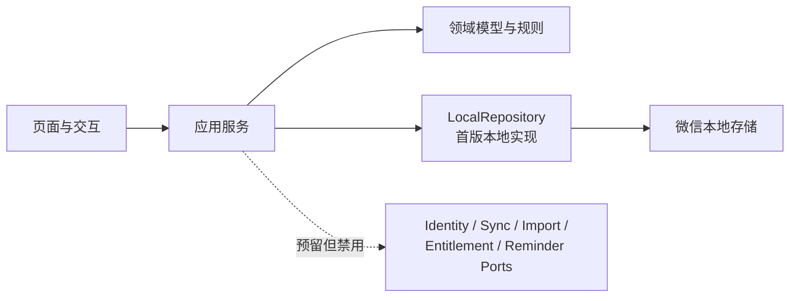

# Plan & Record 产品设计

> 状态：已确认的产品设计基线
> 日期：2026-07-30
> 适用端：首版为微信小程序；后续扩展 Android / iOS / watchOS 与特定 AI 眼镜

## 1. 产品定位

**Plan & Record** 是一套以柳比歇夫时间统计法为事实层的个人计划系统：把尚未承诺的愿望、项目目标、待办计划、日历安排与真实时间投入放进同一条闭环，使用户以实际时间样本校正承诺和预测，而非只维护一张越来越长的待办清单。

产品不把“列出计划”误当作“已经执行”。任何数据均明确区分计划、候选与用户确认后的实际记录；统计和预测默认以实际记录为准。

### 1.1 目标用户

- 想实践柳比歇夫时间统计法，但难以持续实时记录的个人用户。
- 同时管理学习、工作和个人项目，需要了解真实可支配时间的人。
- 希望将纸质时间账本逐步数字化的人。

### 1.2 核心差异化

差异化不在于把计时器、待办、日历和项目管理并排放置，而在于以下闭环：

系统应持续回答四个问题：

1. 我是否有真实容量接下这个 Wish？
2. 这个项目按我的历史投入节奏，能否在截止日前完成？
3. 我对 OKR 的实际投入是否足够？
4. 日历安排与真实时间花销的偏差在哪里，我应如何调整？

## 2. 产品原则与非目标

### 2.1 产品原则

- **用户永远拥有最终解释权。** 记录可晚、可改、可补；日历规则、OCR 和文本 AI 解析只提出候选，不能静默写成“已发生”。
- **一条事实，多种视图。** 日历、项目、待办与统计读取同一份日志和计划数据，禁止复制维护。
- **低摩擦记录，延后精化。** 开始时只需最少操作；标签、计划块关联和备注可随时补充和修改。项目归属不在日志上单独维护，而由计划块关联的任务派生。
- **来源可见/可追溯。** 能查看一条记录来自计时器、文本 AI 导入、OCR 导入、日历规则或用户手工添加；候选记录被用户修改后变为 `confirmed` 状态，但是来源信息保持不变。JSON 全量快照导入不改写记录的原始来源。
- **隐私默认克制。** 照片不长期保存；识别前明确告知数据去向。

### 2.2 首版非目标

- 不做团队协作、成员权限、工时审批和甘特式企业项目管理。
- 不创建云开发环境、自建后端或云数据库，不做微信登录、云端同步和跨设备协同。
- 不实现 OCR / LLM 导入、VIP、广告、支付、订阅消息和云端提醒；这些能力保留为第二阶段待办。
- 不把 Apple Watch、AI 眼镜视作首版交付前提。
- 不依赖微信小程序在后台持续执行 JavaScript 秒表；未暂停的计时通过持久化时间戳恢复。
- 不自动确认用户实际做过某事。日历规则、OCR 和文本 AI 解析只产出候选；用户主动结束计时并生成记录时，视为完成确认。JSON 全量快照导入只恢复快照中已有的状态，不把 `candidate` 自动转为 `confirmed`。

## 3. 统一领域模型

| 对象 | 定义 | 与其他对象的关系 |
| --- | --- | --- |
| Wish / 愿望 | 还未开始、未承诺时间的愿望或想法 | 可在评估后转为项目，也可长期留在愿望池 |
| 项目 | 有结果、边界、截止日期的承诺 | 直接关联 OKR 和任务；计划块与日志的项目维度只通过任务派生 |
| OKR | 项目内拥有的目标与关键结果值集合 | 用于判断项目是否推进，不替代任务清单；不具有脱离项目的独立生命周期 |
| 任务 / TODO | 可完成的单个行动项 | 可选关联一个项目；每个可用计划块必须关联一个任务 |
| 计时器 | 用于记录一次活动的时长并将其转换为时间日志 | 由用户启动、暂停、恢复和结束；可选关联一个计划块，但不直接选择任务或项目 |
| 日历事件 | 某时段的计划安排 | 必须关联一个任务，可生成重复规则；不得直接关联项目 |
| 重复规则 | 用户标记为重复执行的任务计划模板 | 每个可投影修订必须关联任务，按需投影为虚拟候选实例，不等同于实际记录 |
| 时间日志 | 一个时间区间内实际或待核实的活动 | 持有可空标签数组，可选关联一个计划块，并保留备注、来源与修订；不得直接关联任务或项目 |

### 3.1 时间日志状态与统计口径

| 状态 | 含义 | 默认计入“实际投入” |
| --- | --- | --- |
| `candidate` | 来自重复日程、OCR、文本 AI 导入或异常恢复计时，等待用户核实 | 否 |
| `confirmed` | 用户手工记录、主动结束并生成的计时记录，或核实候选后保留 | 是 |

### 3.1.1 计划与实际偏差

计划与实际偏差以单个计划块实例为比较单位：非重复计划块是一个 `CalendarEvent`，重复计划块是重复规则投影出的一个虚拟实例。一个计划块实例可以关联零到多条 `TimeLog`；一条 `TimeLog` 最多关联一个计划块实例，关联可空，且不能只因标签、任务或项目相同就自动建立。

- 关联非重复计划块时，日志使用 `calendarEventId`；关联重复规则投影实例时，日志使用 `originRuleId + originOccurrenceId`。两种表示互斥，都表示同一层级的“计划块关联”。
- 有效的重复计划关联必须同时具有 `originRuleId` 与 `originOccurrenceId`。重复规则被删除后，历史日志可以单独保留 `originOccurrenceId` 作为来源追溯；此时它不再构成计划块关联，不参与计划选择、关系派生或计划偏差归属。运行中的计时草稿和恢复草稿不保留这种历史例外。
- 计划块必须先关联任务；项目只由该任务的 `projectId` 派生。日志不得直接写入或编辑任务、项目关系，也不得以日志中的历史任务/项目快照参与当前关系判断。

- 默认统计只汇总关联该计划块实例的 `confirmed` 日志；用户选择“包含候选估算”时，才一并计算关联的 `candidate` 日志。
- 计划时长等于计划块实例的结束时间减开始时间；实际时长等于关联日志的时长之和；偏差等于实际时长减计划时长。实际为零表示计划尚未产生关联的实际记录，实际超出计划时显示为超时。
- 未关联计划块的日志仍计入标签汇总和总实际投入；没有标签时计入派生的“无标签”统计桶。在偏差统计中，这些日志单列为“非计划实际”，不归入任何计划块，也不具有可统计的任务或项目归属。
- 用户可在创建或编辑日志时关联、改关联或解除关联计划块。计时器从某个计划块启动时预填该关联；手工补录和普通计时不强制关联。

`CalendarEvent` 与 `TimeLog` 是两个实体，重复规则的虚拟实例是计划投影而不是日志。统一时间轴在界面上显示“计划 / 候选 / 实际”，分别对应日历事件或虚拟计划实例、`candidate` 日志、`confirmed` 日志。

用户可在任意时间编辑、确认或作废 `TimeLog`。编辑 `candidate` 日志或确认保留虚拟候选实例后，转为 `confirmed` 日志；作废时删除候选，不得把作废记录转成事实。统计页可选“包含候选估算”，但默认事实统计只纳入 `confirmed`。

### 3.2 日志字段

每条时间日志至少包含：

- `id`、`schemaVersion`
- `startedAt`、`endedAt`、`durationMinutes`
- `calendarEventId?`、`calendarEventSummarySnapshot?`
- `originRuleId?`、`originOccurrenceId?`、`originRuleSummarySnapshot?`
- `taskNameSnapshot?`、`projectNameSnapshot?`：只用于历史展示，不构成关系
- `note?`
- `status`
- `source`：`timer`、`rule`、`ocr`、`file`、`manual`
- `tags`：持久化时必有的字符串数组，允许为空

`TimeLog.taskId?`、`TimeLog.projectId?` 只作为旧 JSON 快照的已知兼容字段保留；除原样恢复旧 JSON 快照外，新建或更新日志时必须写为 `null`，不得作为可编辑字段、有效关系或统计依据。日志可以写入由计划块取得的任务、项目名称快照，但快照只用于计划或任务删除后的历史展示。`CalendarEvent.projectId?` 以及重复规则修订上的直接项目 ID 采用相同兼容原则。

标签协议只存在于 `TimeLog.tags`，不创建独立标签实体、标签 ID 或全局标签管理数据。标签统一经过领域层的同一套规范化与校验规则，页面、应用服务和仓储不得各自实现不同版本：

- `MAX_TAGS_PER_LOG = 10` 表示用户新建日志或实际修改标签时允许保存的单条日志标签数量上限；`MAX_TAG_LENGTH = 5` 表示每个规范化标签的长度上限。
- 单个标签依次执行 Unicode NFKC 规范化、去除首尾空白，并把连续空白折叠为一个普通半角空格 `U+0020`。规范化后为空的标签直接移除。
- 去重以规范化后的精确字符串为准，保留第一次出现的顺序；不折叠大小写，因此 `Work` 与 `work` 是两个不同标签。持久化数组保留该顺序，数组顺序参与 JSON 内容比较。
- 长度使用 `Array.from(normalizedTag).length` 计算 Unicode 码点数。用户实际修改标签时，在规范化、去空和去重后校验每条日志不超过 `MAX_TAGS_PER_LOG`，且每个标签不超过 `MAX_TAG_LENGTH`。
- 页面标签文本使用中英文逗号分隔。规范化后的标签本身含逗号或双引号时，以 CSV 风格的半角双引号包裹整个标签，标签内的双引号写成两个连续双引号；领域层提供统一的可逆解析与格式化，页面不得直接用逗号拼接持久化标签。
- JSON 快照导入同样执行 NFKC、空白处理、去空和去重，但不执行上述数量与长度上限；非字符串标签仍视为字段类型错误。只编辑日志的其他字段时，必须原样保留导入规范化后得到的超限标签数组。判断标签是否实际修改时，先不限额地规范化用户提交值，再与当前持久化数组按顺序逐项比较；相同即视为未修改并保留当前值，不同才对完整的新标签数组执行数量与长度上限。

`tags` 为空数组时，统计层使用独立的内部哨兵把日志归入界面显示为“无标签”的派生桶；该桶不是持久化标签。用户可以创建字面标签“无标签”，它必须与派生桶保持不同的内部身份。

既有日志若关联了一个因任务删除而变为只读历史的计划块，编辑其他字段时保留该关联；一旦解除关联，不得重新选择该计划块。

允许时间重叠，但在保存时给出提醒；例如用户可能希望保留“通勤时听课程”这种双重标记。标签、项目、总投入、容量和预测等时长汇总均累加每条纳入统计的日志 `durationMinutes`，不按墙钟区间去重，因此汇总时长可以大于真实经过的墙钟时长。一条日志有多个标签时，其完整 `durationMinutes` 分别计入每个唯一标签桶，不在标签间均摊，因此所有标签桶合计也可以大于总实际投入。其中项目统计必须先由日志找到计划块，再由计划块的任务找到 `Task.projectId`；链路任一环缺失时不计入具体项目。

用户视图中的统计页，在当前显示时间范围内发现两条或以上纳入当前统计口径的日志存在时间交集时，必须显示非阻断的“重叠时间”提示。提示列出每组重叠的两条记录及重叠分钟数；记录关联计划块时优先显示其任务快照，否则显示日志备注或通用名称。同一对日志在同一显示范围内只提示一次；相邻但不相交的时间区间不构成重叠。默认只检测 `confirmed` 日志，用户选择“包含候选估算”时一并检测 `candidate` 日志。

首版所有日期、时间和重复规则均使用运行设备的默认时区解释和展示；实体、重复规则和实例标识中都不保存或传递独立时区字段。跨设备的时区一致性不属于首版范围，留待后续同步设计。

### 3.3 其他核心对象边界

- `Project.status` 只使用 `active / archived`；项目即使长期没有进展或暂时搁置，仍保持 `active`。归档只用于已完成项目，且是可恢复的状态转换；放弃是需要二次确认的删除操作，不增加第三种项目状态。首版活动项目上限由唯一的领域配置常量 `MAX_ACTIVE_PROJECTS = 5` 表示；新增项目和 Wish 转换都必须使用该常量校验，归档项目不计入上限。
- OKR 作为 `Project` 聚合内的值集合随项目保存和删除，不单独成为可脱离项目存在的顶层实体。
- `Task` 至少包含稳定 `id`、不超过 25 个字符的标题、`status`、可选 `projectId`、`projectNameSnapshot` 和 `completedAt`。`status` 只使用 `todo / completed`：独立 TODO 与项目子任务都直接创建为 `todo`，完成后转为 `completed`；完成任务可重新打开为 `todo`。当前处于早期开发，不提供旧 `inbox` 本地快照或导入文件的兼容与迁移。
- `OKR` 的关键结果只包含稳定 `id`、`title` 和完成情况 `currentValue`；`currentValue` 用 `[0, 100]` 范围内的整数表示，单位为“%”。
- `CalendarEvent` 只表达计划时间块，至少包含稳定 `id`、开始/结束时间、必需的 `taskId` 与 `taskNameSnapshot`，以及可选重复规则关联和 `repeatRuleSummarySnapshot?`；它不承载 `TimeLog` 的事实状态，也不直接关联项目。只有任务删除后保留的历史计划块可以没有有效 `taskId`，此时保留任务名称快照并禁止作为新日志的关联目标。计划块可选优先级为整数 `1` 到 `MAX_PLAN_PRIORITY = 3`，界面仅以由浅到深的绿色表示优先级，禁止显示数值或优先级文字。
- 首版重复规则支持每日、每周（指定星期）和每月（按日期），均可设置正整数间隔值。每个可投影修订必须关联任务；其虚拟实例的项目同样只由该任务的 `projectId` 派生。

## 4. 首版体验设计

### 4.1 快速计时

首页（底部导航栏第一项，用一个秒表图标展示）就是计时功能：

- 无计时器运行时，点击主按钮直接开始记录。
- 正在计时时，主按钮变成暂停按钮；暂停后可以恢复，也可以结束计时。
- 结束后必须点击“生成记录”才正式保存；该操作表示用户确认本次计时，生成 `confirmed` 日志。
- 小程序进入后台后，未暂停的计时仍按墙钟时间累计；前台恢复或冷启动时根据持久化时间戳重算，不依赖后台 JavaScript 定时器。
- 恢复时若持久化字段完整、墙钟未倒退且自开始起不超过 24 小时，则按原运行/暂停状态继续；超过 24 小时或暂停区间不一致时终止运行态，并以可恢复时间生成 `candidate`。若连合法时间区间都无法还原，只保留恢复草稿，用户修正后才能创建候选日志。
- 首页提供“手工补录”次级入口，可填写任意过去时间区间、可空标签及可选计划块；不选计划块时记为“非计划实际”，用户主动保存的手工记录直接生成 `confirmed` 日志。
- 用户可随时修改当前记录的标签、可选计划块和备注；计时与补录界面不提供任务或项目选择控件。选择计划块后，任务由计划块确定，项目再由任务的 `projectId` 派生；生成记录后保存数据并清空表单。
- 不强制填写完整信息，而是让用户先留下可被日后修正的样本。

#### 4.1.1 照片导入

> **待办（第二阶段）**：首版不上传图片、不接入 OCR / LLM，也不展示广告入口。开发时保留 `ImportPort` 边界，不在页面或领域逻辑中直接依赖云服务。

第二阶段拟支持用户将一页或多页纸质时间账本拍照导入：

1. 在小程序中拍照或从相册选择图片。
2. 客户端经受控接口上传到私有存储。
3. 后端调用 OCR 提取原文与版面位置。
4. AI 将 OCR 结果解析为导入草稿：开始时间、结束时间、事项、可选标签、可选计划块匹配建议与备注等；不得生成标签实体或标签 ID，也不得直接生成日志的任务或项目关系。草稿确认落库前，标签必须执行 [3.2 日志字段](#32-日志字段) 的领域规范化与用户输入上限。
5. 导入页同时展示原图、OCR 原文和候选项；用户可逐条编辑、跳过或批量确认。
6. 用户确认保留后才创建日志，并保留 `source = "ocr"`。

后续还可提供可打印的纸质时间账本模板，以提高识别准确率；该模板同样不是首版范围。

#### 4.1.2 文本 AI 导入

> **待办（第二阶段）**：首版不实现文本 AI 解析。本节与首版用于迁移和恢复的 JSON 全量快照导入不是同一种能力。

第二阶段的文本 AI 导入直接把用户提交的文本解析为导入草稿，无需 OCR；草稿标签遵循 [3.2 日志字段](#32-日志字段) 的同一套领域规则，用户确认后创建的日志保留 `source = "file"`。

### 4.2 愿望/项目视图

底部导航栏第二项是愿望/项目视图，用一个 ToDoList 图标展示，页面由以下部分组成：

- TODO LIST：位于页眉之后、项目列表之前，卡片总高固定为 `420rpx`。新建任务插入开头，其余任务保持保存顺序，每 3 条横向分列展示全部任务；禁止纵向滚动，横向滑动按整列吸附，且不显示行分隔。每行提供勾选方框、任务标题、可选项目名称小字，以及表示“关联项目”和“删除”的图标按钮。勾选在 `todo / completed` 间切换；关联菜单的第一项必须是“取消关联”，其后仅列出活动项目；删除必须经二次确认，并明确说明未结束的关联计划会一并删除，已结束计划和计时记录会保留。
  - TODO 的“+”入口打开新建表单，标题必填，关联活动项目可选且默认不关联；点击任务标题或关联项目名称打开同一表单编辑任务。
- 项目视图：一个纵向列表，位于 TODO LIST 下方，展示所有项目（有 OKR 和截止日期的复杂任务）。
  - 活动项目列表受 `MAX_ACTIVE_PROJECTS = 5` 限制；已有等于上限的活动项目时，新增和 Wish 转换都不得创建项目，并提示用户先归档、放弃或取消本次操作。
  - 列表末尾右对齐的“+”打开新建项目底部弹层；达到上限时隐藏该入口。新建项目仍要求标题、OKR 与截止日期。
  - 每个活动项目展示 `OKR` 与“+子任务”入口；前者打开该项目的 OKR 表单，后者直接创建关联该项目的 `todo`。标题可打开子任务弹层，按未完成和已完成分栏；首版只展示任务名称。编辑、归档与放弃属于低频管理操作，收进二级管理菜单。
  - 已完成的项目可归档，从列表中移除但保留数据，标记为 `archived`。
  - 不再继续的项目可放弃：删除项目、OKR、未完成任务、尚未结束的日历事件、这些事件的重复规则/修订/跳过标记，以及关联的 `candidate` 日志。已结束的历史日历事件、已完成任务和 `confirmed` 日志作为复盘历史保留，并按 [5.2 核心数据边界](#52-核心数据边界) 清空任务或重复规则等失效引用，保留仍有效的计划块关联与名称快照。
  - 历史 `confirmed` 日志只能通过独立的日志删除操作移除，不能由放弃项目级联删除。
  - 归档和放弃都必须弹出确认框；放弃确认框要明确说明删除范围与保留范围。
  - 可点击查看项目关联的子任务列表，列表以弹层展示，分为已完成和未完成两个页签；首版只展示任务名称。
- 愿望视图：一个纵向列表，位于项目列表下方，默认折叠，展示所有未开始、未承诺时间的想法。
- 添加愿望时只需输入不超过 25 个字符的描述；添加项目时需要输入不超过 25 个字符的描述、OKR 和截止日期。
- 愿望可一键转化为项目：仅在活动项目数量小于 `MAX_ACTIVE_PROJECTS` 时允许转换；描述保持不变，OKR 为空且用户可随时补充，截止日期为当前时间后推 24 小时。
- 用户可继续编辑项目和愿望的数据。

### 4.3 日历视图

底部导航栏第三项是日历视图：

- 日、周、月、年视图共用同一份日历事件与时间日志。
- 日历同时展示计划块、候选和实际，并用文字状态、边框和颜色区分；三种显示分别来自 `CalendarEvent`、虚拟候选或 `candidate`、`confirmed`。
- 点击计划块或日志可进入统一详情：计划块可编辑计划；`candidate` 可编辑、确认或作废；`confirmed` 可编辑或经二次确认后删除。任何编辑都保留原始 `source`，项目放弃不能代替日志删除。
- 创建或编辑日历计划块时必须选择一个任务；日历页不得提供直接关联项目的控件或写入路径。任务是否属于项目由 `Task.projectId` 决定，计划块只可把派生的项目名称作为只读上下文展示。
- 任务计划可设预估开始时间、结束时间和优先级；项目自身维护 OKR、子任务和截止日期。
- 计时器为某个计划块生成或恢复日志后，统一时间轴显示对应的候选或实际记录，但不覆盖原计划实体。
- 用户可在创建或编辑日志时选择一个计划块；具体 `CalendarEvent` 使用 `calendarEventId`，重复规则投影实例使用 `originRuleId + originOccurrenceId`。从计划块启动计时时预填该关联；不选时为“非计划实际”。日志关系控件只提供计划块，不提供任务或项目；标签是 `TimeLog` 自身的可空值字段，不属于关系控件。
- 计划块选择器必须同时包含相关的具体计划块与按记录时间范围投影的重复实例。某个计划块已经关联了日志时仍须可选，因为一个计划块允许关联多条日志；只有已被具体 `CalendarEvent` 表示的重复种子实例需要去重，不能按既有日志去重。
- 某个任务计划可设置为“固定习惯/循环”，例如“每天 19:30–20:30 深度工作”或“每周日 09:00–10:30 打扫卫生”。
  - 循环任务在用户查看相关日期范围时投影为虚拟候选，详见 [4.3.1 日历规则](#431-日历规则)。
- Wish 池不占用日历容量，只有显式转为项目后才进入计划系统。

#### 4.3.1 日历规则

采用**按需投影**：用户无需提前打开小程序；下次查看日历或统计时，客户端根据重复规则为查询范围计算虚拟候选实例。

虚拟候选不立即写入 `TimeLog`。用户确认或编辑后创建日志；用户跳过时保存该次实例的例外标记。所有实例使用确定性标识，避免同一规则在多次查看或未来多端同步时重复生成。

“虚拟候选”描述的是实例在确认前的界面状态；在关系与偏差模型中，它仍是一个重复规则投影出的计划块实例，不是带有 `candidate` 状态的 `TimeLog`。

日历和统计查询按实例的最终时间区间判断是否纳入：`endedAt > rangeStart && startedAt <= rangeEnd`，即与查询范围存在非零交集。跨越日、周、月或年范围起点的实例仍应被投影；单次改期以原始发生时间定位实例，再按改期后的最终区间决定移入或移出，跳过实例不纳入。纳入后的记录保留完整持续时间，不在查询边界处裁剪。

重复规则的每个可用修订都必须关联任务且不得直接关联项目。投影实例沿命中修订取得 `taskId`，再沿 `Task.projectId` 取得项目；确认或编辑实例产生的日志保存 `originRuleId + originOccurrenceId` 作为计划块关联，并把任务、项目名称快照仅用于历史展示。

### 4.4 用户视图

位于底部导航栏第四项（最右侧）。首版提供本地设置、JSON 数据管理和日志统计分析，不展示登录、VIP、同步或云端提醒入口。

- 用户以匿名本地资料库使用全部首版能力。
- 数据管理提供“导出 JSON”“导入 JSON”和“清空数据”。导出文件包含数据结构版本、实体 ID、关系、日志状态和来源；用户可将文件发送给文件传输助手并从电脑微信另存，也可在支持的微信环境中选择 JSON 文件进行手动迁移或恢复。
- 导入前展示模式、增量数据、冲突和失效关联修复摘要；清空或覆盖本地数据前必须二次确认。完整规则见 [5.4 本地持久化、JSON 导入导出与清空](#54-本地持久化json-导入导出与清空)。
- 明确提示用户：小程序本地数据仍可能因清理缓存、卸载微信或更换设备而丢失；JSON 导入导出是用户主动执行的本地迁移能力，不是云端自动备份或同步。
- **待办（第二阶段）**：微信登录。
- **待办（第二阶段）**：VIP 订阅、广告门槛与支付；具体权益和价格在实施前另行确认。
- **待办（第二阶段）**：云端自动同步，以及观看广告后触发的手动同步。
- **待办（第二阶段）**：订阅消息和复盘提醒；必须在用户主动授权且平台能力允许时发送。

#### 4.4.1 日志统计分析

- 默认只统计 `confirmed`，可选择包含 `candidate` 估算。
- 首版至少提供按标签和项目汇总、按 [3.1.1 计划与实际偏差](#311-计划与实际偏差) 计算的计划与实际偏差，以及周复盘所需的基础数据。
- 标签汇总直接使用日志的 `tags`：每条日志的完整时长分别计入每个唯一标签桶，大小写不同的标签分别统计；空数组通过独立内部哨兵计入界面显示为“无标签”的派生桶，用户创建的字面标签“无标签”仍是另一个普通标签桶。项目汇总必须由日志关联的具体计划块或重复投影实例取得任务，再读取该任务当前有效的 `projectId`。无计划块、计划块缺少有效任务或任务未关联项目的日志不归入具体项目；任务/项目名称快照只用于历史展示，不参与当前项目统计。
- 具体图表样式在页面设计阶段确定，不改变上述统计口径。

## 5. 技术边界与架构

### 5.1 首版架构原则

首版采用**纯本地、匿名、单设备**架构。除用户主动导出并选择微信会话发送外，业务数据不经网络离开当前微信客户端；JSON 导入文件只在客户端本地读取和处理。首版不创建云开发环境，不调用自建或托管后端，也不实现登录、同步协议和跨设备一致性。

| 层 | 首版职责 |
| --- | --- |
| 页面与交互 | 计时显示、表单、项目和日历视图、候选核实、统计，以及 JSON 导入、导出和清空确认 |
| 应用服务 | 编排用户操作和领域规则；页面不得直接读写存储或调用未来云能力 |
| 领域模型 | 维护项目、计划、日志、计时器、重复规则及状态转换 |
| `LocalRepository` | 本地持久化、结构版本迁移、JSON 快照校验与原子导入、导出和清空 |
| 预留端口 | 首版使用匿名本地或禁用实现，只定义职责边界，不包含云配置和同步协议 |

### 5.2 核心数据边界

- `CalendarEvent` 保存计划；`TimeLog` 只保存 `candidate` 或 `confirmed`。统一时间轴负责把两类实体投影为“计划 / 候选 / 实际”。
- 首版唯一有效的业务关系链是 `TimeLog → 计划块实例 → Task → Project?`：日志可不关联计划块；计划块必须关联任务；任务可不关联项目。具体计划块通过 `calendarEventId` 关联，重复投影实例通过 `originRuleId + originOccurrenceId` 关联。`TimeLog.tags` 是日志自身的值字段，不是实体关系。
- `CalendarEvent.projectId`、重复规则修订的直接项目 ID，以及 `TimeLog.taskId / projectId` 是旧快照兼容字段，不属于上述关系链。除原样恢复旧 JSON 快照外，新建或更新实体时这些 ID 必须为 `null`；旧快照中的原值可以物理保留，但必须在关系校验、可选项生成、统计和后续领域写入中忽略。对应名称快照只用于历史展示，不得成为关系修复来源。
- Wish、项目、任务、日历事件、重复规则和日志从首版开始使用稳定的全局唯一 ID，禁止依赖数组下标或显示名称建立关系。
- 当前本地数据和 JSON 快照协议继续使用 `schemaVersion = 1`；每个实体至少保留 `createdAt`、`updatedAt`，需要追溯来源的实体保留不可静默改写的 `source`。
- 首版只有本地生成的 `localProfileId`，它表示当前匿名资料库，不冒充微信账号。
- 放弃项目作为一个原子本地操作：以确认删除的时刻为界，从该项目关联的任务出发，删除项目、OKR、未完成任务、这些任务尚未结束的日历事件、对应重复规则及修订、虚拟实例、跳过标记和关联的 `candidate` 日志。已完成任务保留项目名称快照并清空 `projectId`；经这些任务保留的历史计划块和日志继续保留有效计划块关系，但不再具有有效项目关系。
  - 若其他项目或独立任务的重复规则中，某个单次修改实例改为关联本项目任务，只删除该实例的有效计划关系，不删除整条重复规则。对应例外改为同一逻辑槽位的 `skip`，防止底层原实例重新出现；关联的 `candidate` 日志删除，`confirmed` 日志保留 `originOccurrenceId` 与规则摘要但清空 `originRuleId`，计时草稿和恢复草稿清空该实例关联。
- 显式删除单个任务需要二次确认。删除任务实体时，删除其关联且结束时间晚于删除时刻的日历事件，以及这些事件/任务关联的重复规则、修订和例外；保留已结束日历事件、全部时间日志和计时草稿。
  - 已结束的历史 `CalendarEvent` 清空 `taskId`，保留 `taskNameSnapshot`、`projectNameSnapshot` 与重复规则摘要快照，并变为只读历史计划块；它仍用于既有日志的计划偏差复盘，但不得作为新日志或新计时的关联目标。
  - 既有日志若仍指向上述保留的历史 `CalendarEvent`，保留其 `calendarEventId`；只有对应计划块被删除时才清空失效的 `calendarEventId` 并保留计划块、任务和项目名称快照。删除重复规则时则按下条处理 `originRuleId`。
  - 计时草稿若指向已删除或已失去有效任务的计划块，清空计划块关联；日志和草稿都不得退回使用直接 `taskId` 或 `projectId`。
  - 若一条仍保留的重复规则只有某个单次修改实例关联该任务，则把该例外改为同一逻辑槽位的 `skip`，不得简单删除例外使底层实例恢复。该实例的全部日志继续保留，但清空 `originRuleId` 并保留 `originOccurrenceId` 与规则摘要；计时草稿和恢复草稿清空该实例关联。
- 已完成任务及 `confirmed` 日志保留为历史。日志继续通过仍存在的计划块取得有效任务关系；任务或项目已不存在时只展示名称快照，不把快照恢复为有效关系。
- 结束时间不晚于删除时刻的历史 `CalendarEvent` 为计划偏差复盘继续保留；它保存任务、项目和重复规则摘要快照，并清空已失效的 `taskId` 和 `repeatRuleId`。删除重复规则后，保留的历史事件不得再通过该 ID 查询或投影规则实例。
- 来自被删除重复规则的 `confirmed` 日志继续保留 `source = "rule"` 和 `originOccurrenceId`，保存 `originRuleSummarySnapshot` 后清空 `originRuleId`；删除规则后不得再投影新实例。
- 第二阶段绑定微信账号、第四阶段跨账号迁移时，通过受控映射改变资料库归属，不重写实体 ID 和内部引用。这些能力必须由服务端鉴权、审计并再次取得用户确认，不属于首版。

### 5.3 计时器与重复规则

运行中的计时器至少持久化开始时间、当前状态、暂停区间或累计暂停时长，以及当前填写的标签数组、可选计划块关联和备注；不得持久化可编辑的任务或项目关系。计时草稿的标签也使用 [3.2 日志字段](#32-日志字段) 的领域规则。

- 前台定时器只负责刷新显示，不是计时事实来源。
- 进入后台后，只要用户没有暂停，逻辑时间继续累计；恢复前台或冷启动时按持久化时间戳重算。
- 用户主动结束并点击“生成记录”后创建 `confirmed`。
- 恢复校验通过的条件是必需字段完整、当前墙钟不早于开始时间、暂停数据自洽，且自开始起不超过 24 小时；通过后恢复原运行/暂停状态。
- 墙钟跨度超过 24 小时或暂停数据不一致时终止运行态，以仍可还原的合法区间创建 `candidate`；无法还原合法区间时只保留恢复草稿，禁止写入无效日志。

重复规则不预先批量创建日志。每个规则修订包含 `effectiveFrom` 和可选 `effectiveUntil`；查询范围只使用覆盖该时间段的修订，并以 `ruleId + ruleRevision + occurrenceStart` 生成确定性的实例标识：

- 每个可投影修订必须保存有效 `taskId` 与任务名称快照，不保存有效 `projectId`；项目仅在读取时由 `Task.projectId` 派生。
- `occurrenceStart` 表示沿规则修订链保持稳定的逻辑发生槽位，以所选实例及修订的 `effectiveFrom` 为锚点；它可以与调时或单次改期后的最终 `startedAt` 不同。规则修订改变开始时刻时不得用新的 `startedAt` 改写既有实例的逻辑槽位。
- 未操作实例只存在于视图投影中。
- 确认或编辑实例时创建日志，并保存来源规则与实例标识。
- 跳过实例时保存例外标记，避免下次查看时重新出现。
- 只编辑一次实例时创建该次 override，不修改规则；编辑“此项及后续”时创建从所选实例起生效的新修订，并结束旧修订的生效区间。
- 已确认、已编辑或已跳过的实例不因规则修改而重写；投影新修订前，以 `ruleId + occurrenceStart` 检查跨修订 override/跳过标记，避免同一次实例重新出现。

### 5.4 本地持久化、JSON 导入导出与清空

- 每次修改必须先完成本地写入，再向用户显示“已保存”；写入失败时保留表单内容并提供重试或导出入口。
- 多实体操作要避免半完成状态；实现时采用单快照提交或可恢复的操作标记，并为结构迁移保留升级前快照。
- 读取到不支持的数据版本或损坏数据时停止覆盖原数据，显示明确的恢复说明。

#### 5.4.1 JSON 导出

- 每次导出以用户点击时取得的同一份应用快照生成文件；生成后发生的新写入不进入本次文件。
- JSON 全量导出包含实体 ID、关系、`schemaVersion`、日志状态、来源及每条日志必有的 `tags` 数组，不包含独立标签实体。接收文件名为 `plan-and-record-YYYYMMDD-HHmmss.json`，使用 UTF-8 编码。
- 为读取旧快照而保留的 `CalendarEvent.projectId`、重复规则修订直接项目 ID 和 `TimeLog.taskId / projectId` 可以继续作为已知字段出现在导出协议中。新建或编辑后的实体应为 `null`；原样恢复且尚未经过领域更新的旧实体可以保留原值。无论物理值为何，它们都不表示当前有效关系；名称快照可以有值。
- JSON 不通过 `wx.openDocument` 预览。客户端确认平台支持文件发送后再生成临时文件，由用户选择微信会话发送；不支持时不生成文件，并明确提示用户升级微信。用户可发送给文件传输助手，再从电脑微信另存。
- 发送成功、取消或失败后都删除本次临时文件；进入用户页时清理由本产品旧版本明确生成的导出临时文件，但不得匹配或删除其他近似命名文件。

#### 5.4.2 JSON 导入

- 首版只支持导入本产品 JSON 全量快照协议，不支持 CSV 数据协议。用户选择文件后，客户端在本地读取、解析、校验和生成预览，确认前不得修改本地数据。
- 当前 JSON 协议中的关键结果 KR 只保存稳定 `id`、标题与 `[0, 100]` 整数“完成情况”（`currentValue`）。
- 为兼容历史导出或同版本扩展字段，解析时只保留当前 JSON 协议已定义的字段；未知字段直接忽略，不写入本地资料库、不参与冲突比较，也不单独提示用户。已定义字段仍须完整且类型合法；`schemaVersion` 缺失或版本不受支持时拒绝整次导入。
- 本次协议调整仍使用 `schemaVersion = 1`，不为本次已移除的旧投入维度提供兼容迁移。相关旧根集合及日志字段不再是已定义字段，解析时按未知字段规则忽略，不转换为 `TimeLog.tags`。当前协议要求每条 `TimeLog` 的 `tags` 必须存在且类型为数组；缺失时拒绝整次导入。
- 解析旧快照时可以读取并物理保留 `CalendarEvent.projectId`、重复规则修订直接项目 ID 和 `TimeLog.taskId / projectId`，它们作为已定义的持久化兼容字段参与内容比较。原样恢复不等于恢复有效关系：这些旧 ID 不得参与关系校验、可选项生成或统计，也不得生成新的任务/项目关系；实体下一次经领域新建或更新流程保存时，相应 ID 写为 `null`。对应名称快照可以继续保留用于历史展示。
- 解析 `TimeLog.tags` 时执行 [3.2 日志字段](#32-日志字段) 的 NFKC、首尾空白去除、连续空白折叠、去空和精确去重，并保留第一次出现的顺序；大小写不同的标签不去重。JSON 导入不执行 `MAX_TAGS_PER_LOG` 与 `MAX_TAG_LENGTH` 的业务上限，但数组元素仍必须是字符串。该规范化不是失效关联修复，不计入“修复了 N 个失效关联”。
- 导入保留实体 ID、内部关系、日志状态和原始 `source`。JSON 快照导入本身不是新的日志来源，也不会把 `candidate` 自动确认为 `confirmed`。
- 用户选择以下一种导入模式：
  - **增量导入**：保留本地数据，加入本地尚不存在的实体。同一 ID 且内容相同的实体直接跳过；同一 ID 但内容不同的实体计为数据冲突。内容比较基于解析、标签规范化后的全部持久化字段，包含 `createdAt`、`updatedAt` 等元数据；数组顺序包括 `TimeLog.tags` 的首次出现顺序，参与内容比较。比较忽略 JSON 对象属性的书写顺序，禁止直接比较原始 JSON 字符串。
  - **覆盖本地数据**：语义上先清空本地数据，再按相同的增量规则导入快照。清空、校验、修复和导入必须组成一次原子提交；任一步失败时保留导入前的完整本地数据，禁止出现已经清空但没有导入完成的状态。
- JSON 快照中的运行态不跨设备恢复：增量导入保留本机 `localProfile`、当前计时器、恢复草稿和资料库创建时间；覆盖导入创建新的 `localProfile`，把计时器重置为 `idle`、清空恢复草稿，并以导入提交时间作为新资料库的创建和更新时间。两种模式都不得导入快照中的 `timer` 或 `recoveryDraft`；导入提交成功后，根级 `updatedAt` 使用本次提交时间。
- 增量导入存在数据冲突时，预览汇总冲突数量，并要求用户对本次导入统一选择“全部保留本地”或“全部使用导入数据”；不得静默覆盖，也不对不同冲突混用策略。用户取消时整次导入不写入。
- 可修复的失效关联不视为文件损坏。引用是否失效必须以增量补充和冲突决策完成后的最终合并结果判断；只要被引用实体存在于最终结果中，就不得因它未出现在导入文件内而清空引用。导入预览必须显示“修复了 N 个失效关联”，`N` 按被清空、重映射或丢弃的失效关联逐项计数，修复规则为：
  - 任务引用的项目不存在时清空 `Task.projectId` 并保留项目名称快照。计划块或重复规则修订引用的任务不存在时清空 `taskId` 并保留任务、项目名称快照；修复前不得用于新日志关联或继续投影。已经结束的计划块只作为只读历史展示，不得通过编辑补绑任务；尚未结束的计划块可以在编辑时选择有效任务完成修复。
  - 日志引用的具体计划块不存在时清空 `calendarEventId` 并保留计划块、任务和项目名称快照；如果计划块存在但已经没有有效任务，保留已有 `calendarEventId` 仅用于历史偏差复盘，但不得把该计划块作为新选或改选目标。
  - 日历事件或时间日志找不到所引用的重复规则时，清空失效的 `repeatRuleId` 或 `originRuleId` 并保留重复规则摘要快照；找不到重复规则的跳过/单次修改例外已经没有作用对象，直接丢弃。
  - 增量导入保留的本机计时草稿和恢复草稿也必须针对最终合并结果修复关系：具体计划块不存在或已经没有有效任务时清空 `calendarEventId`；重复实例不存在、已跳过或已经没有有效任务时同时清空 `originRuleId + originOccurrenceId`。每个被清空的计划关联计为一次修复；草稿中的旧 `taskId / projectId` 直接归一化为 `null`，不作为有效关系，也不增加修复计数。
- JSON 结构错误、必需字段或字段类型错误、`TimeLog.tags` 缺失、不是数组或含非字符串元素、导入文件内部出现重复 ID、同一日志或计时草稿同时声明具体计划块与重复计划关联、`originRuleId` 缺少配套 `originOccurrenceId`、`schemaVersion` 缺失或版本不受支持等属于不可修复的数据损坏。标签经规范化后的数量或长度超过用户输入上限不属于损坏。历史日志单独保留 `originOccurrenceId` 的情况按上文来源追溯例外处理。发现任一不可修复问题即拒绝整次导入，不生成可提交的合并结果，也不修改任何本地数据。
- 导入校验不得把 `MAX_ACTIVE_PROJECTS = 5` 当作拒绝条件。合并后可以暂时超过 5 个活动项目；之后新增项目和 Wish 转换仍执行原有上限校验，直到活动项目数量重新低于上限。
- 同一时刻只允许一个数据管理操作；从文件选择、预览、确认到原子提交结束前，不得与另一项导入、导出或清空操作交错执行。

#### 5.4.3 清空数据

- “清空数据”删除当前匿名资料库的全部用户数据、计时状态、恢复草稿、结构迁移前备份，以及小程序文件沙箱内由本产品明确生成且仍然存在的导出临时文件；随后重新建立一个空资料库。已由用户发送或另存到微信会话、电脑等外部位置的 JSON 文件不属于小程序本地数据，不受清空操作影响。
- 清空前必须用明确的破坏性提示二次确认；用户取消时不修改数据。清空必须先完整枚举并删除本产品拥有的导出临时文件，再原子重置资料库；目录读取、文件枚举或任一非“文件不存在”的删除失败时不得重置资料库，也不得显示成功。若临时文件已删除后资料库写入失败，仍须保留原资料库并提示失败；临时导出文件属于可重新生成的派生文件。只有文件清理和资料库重置都成功后才能清除待处理导入并提示“数据已清空”。
- 首版不保存照片等大文件。页面必须说明微信缓存、卸载或更换设备可能导致本地数据丢失。

### 5.5 后续能力预留端口

| 端口 | 首版实现 | 待办实现 |
| --- | --- | --- |
| `IdentityPort` | `AnonymousIdentity`，只返回 `localProfileId` | 第二阶段接入 CloudBase 托管微信登录 |
| `SyncPort` | 禁用；不创建 outbox，不定义同步协议 | 第二阶段单独设计后端持久化、冲突处理和跨设备同步 |
| `ImportPort` | 仅指 AI 导入能力，首版禁用；本地 JSON 快照导入由微信应用服务和 `LocalRepository` 完成 | 第二阶段接入私有上传、OCR、LLM 和人工确认 |
| `EntitlementPort` | 不区分会员，不触发广告或支付 | 第二阶段接入 VIP、广告完成校验和支付权益 |
| `ReminderPort` | 禁用云端提醒 | 第二阶段在用户授权和平台能力允许时接入订阅消息 |

领域层和页面只依赖端口表达的业务能力，不依赖 `wx.cloud`、具体供应商 SDK、环境 ID 或服务地址。禁用实现必须返回明确的“当前版本暂不支持”，不能伪造成功结果。

### 5.6 第二阶段云能力边界

> **待办（第二阶段）**：本节只保留安全边界，不在首版定义具体同步协议或创建云资源。

- 登录、同步、AI 导入、权益和提醒分别设计接口，不能以一个万能云函数承载全部业务。
- 服务端从可信会话推导资源归属，不接受客户端自报用户 ID。所有读取、列表、写入、删除、导出、附件访问和异步任务查询都校验登录态与资源归属；有副作用的操作还必须校验参数和幂等键。
- OCR / LLM 只生成受限 Schema 的导入草稿，不能直接写入正式日志，也不能编造标签实体、标签 ID、项目 ID 或任务 ID；草稿确认持久化前，标签统一执行 [3.2 日志字段](#32-日志字段) 的规范化与用户输入上限。
- 原图使用私有临时对象；成功、失败、取消和孤儿上传都要有清理策略。用户明确选择保留后才能转为长期附件。
- 同步必须另行定义账号隔离、操作去重、删除墓碑、修订历史和用户可见的冲突处理；不得直接采用通用字段级最后写入优先。
- 首次微信登录合并匿名资料库时必须再次征得用户确认；切换账号后暂停并隐藏旧账号数据。

### 5.7 成本边界

首版不创建云环境，不产生产品侧云函数、数据库、存储、OCR 或模型调用成本。

> **待办（第二阶段）**：实施前按当期控制台重新核对 CloudBase 认证与套餐、数据库、函数、存储、流量、OCR、模型 Token、订阅消息和支付成本；产品设计基线不固化一次性的价格估算。

## 6. 隐私与数据安全

### 6.1 首版本地数据

- 首版业务数据默认只保存在当前设备的微信小程序本地存储中，不自动上传到开发者或第三方服务。
- 不收集 OpenID、手机号、头像或昵称，不把匿名资料库描述成微信账号。
- 导出只能由用户主动触发；导出前说明文件包含的日志、项目、备注和标签信息。用户继续选择微信会话后，导出副本会发送到该会话；这一用户主动发送行为不构成应用自动同步或云端备份。
- JSON 导入只能由用户主动选择文件触发；文件内容只在客户端本地读取和校验，不自动上传。日志、调试输出和错误提示不得包含完整导入/导出内容、密钥或不必要的个人信息。
- 用户删除日志或放弃项目时，界面必须明确说明删除范围；项目删除不得连带删除已确认日志。
- 首版提供用户主动执行的 JSON 迁移和恢复，但不承诺云端自动备份、自动同步或无人值守的换机恢复；必须在用户视图和数据管理入口明确提示本地数据丢失风险。

### 6.2 第二阶段数据处理待办

> **待办（第二阶段）**：任何云能力上线前，补齐数据处理方、用途、地域、保存期限、删除时点和失败清理策略，并完成真实生产权限验证。

- 图片上传前说明用途、接收方、保存时长和删除选项。
- 默认只长期保留结构化结果；原图、OCR 原文、模型输入输出、任务日志和备份分别定义保留期限。
- 访问控制按可信账号隔离；密钥、AppSecret、模型 Key、支付签名和长期令牌不得进入小程序代码、日志、query 或 Handoff payload。
- AI 输出、导入引用和批量写入在持久化前校验 Schema、数量、时间区间和资源归属；除 JSON 快照导入明确允许标签超出用户输入上限外，所有创建或实际修改标签的写入都由领域层执行同一套标签规则。

### 6.3 第四阶段跨账号迁移约束

- 第二阶段只允许用户确认后将匿名 `localProfileId` 一次性绑定或合并到当前首次登录的微信账号，不等同于账号间迁移。
- 跨账号迁移必须由来源账号和目标账号共同确认，保留审计记录，并提供可撤销或人工处理的失败出口。

## 7. 分期范围

### 第一阶段：纯本地微信小程序闭环

- 匿名本地资料库，不登录、不创建云环境；除用户主动文件发送导出外，不发送业务数据。
- 计时、暂停、恢复、结束、异常恢复和任意日期手工补录。
- 带可空标签的时间日志、备忘录、Wish、项目、任务、OKR、截止日期。
- 日、周、月、年日历，以及计划、候选、实际三种统一时间轴显示。
- 固定日程的确定性按需投影、确认、修改和跳过。
- 基础项目和标签统计（含派生的“无标签”桶）、计划与实际偏差、周复盘。
- JSON 全量数据可通过微信文件发送导出，并支持本地校验、增量或覆盖导入；用户可二次确认后清空全部本地数据。首版不支持 CSV 数据协议。

### 第二阶段：云能力、AI 导入与商业化待办

- CloudBase 托管微信登录，以及匿名资料库经确认后的账号绑定。
- 后端持久化、手动/自动同步、冲突处理、修订历史和云端恢复。
- 纸质日志拍照导入、文本 AI 导入、OCR / LLM 草稿解析与人工确认。
- VIP、广告、支付和服务端权益校验。
- 在用户授权且平台能力允许时发送订阅消息和复盘提醒。
- 实施前完成 AppID 权限、生产鉴权、隐私、配额和计费核对。

### 第三阶段：原生高频记录入口

- 原生 Android / iOS 应用，以及独立或配套的 watchOS 应用。
- 开始、暂停、切换、完成、查看下一项和表盘快捷入口。
- 后台刷新只用于机会式同步和快照更新，不承担连续秒表或精确定时。
- 前台在线时以近实时为目标的跨设备同步，以及最终一致的离线兜底。
- 更可靠的项目完成预测与容量建议。

### 第四阶段：远期试点

- 选定一款开放协议或 SDK 的 AI 眼镜，只试点语音开始/结束计时、播报下一任务和捕捉 Wish。
- 不在验证设备 SDK、目标地区、续航、网络与隐私能力前承诺相机、手势或系统级语音控制。
- 增加经服务端鉴权、双向确认和审计的跨账号数据迁移。

## 8. 外部能力参考

- [微信小程序运行机制](https://developers.weixin.qq.com/miniprogram/dev/framework/runtime/operating-mechanism.html)
- [CloudBase：创建云开发环境](https://docs.cloudbase.net/quick-start/create-env)
- [CloudBase：微信小程序身份认证](https://docs.cloudbase.net/ai/cloudbase-ai-toolkit/prompts/auth-wechat)
- [腾讯云 OCR：通用文字识别（高精度版）](https://cloud.tencent.com/document/product/866/34937)
- [CloudBase 云函数介绍](https://docs.cloudbase.net/cloud-function/introduce)
- [微信小程序订阅消息](https://developers.weixin.qq.com/miniprogram/dev/framework/open-ability/subscribe-message.html)
- [Apple：独立 watchOS App](https://developer.apple.com/documentation/watchos-apps/creating-independent-watchos-apps/)
- [Apple：watchOS 后台任务](https://developer.apple.com/documentation/watchkit/using-background-tasks)
